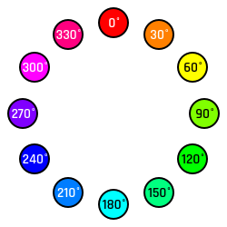
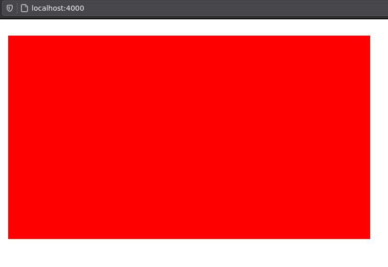
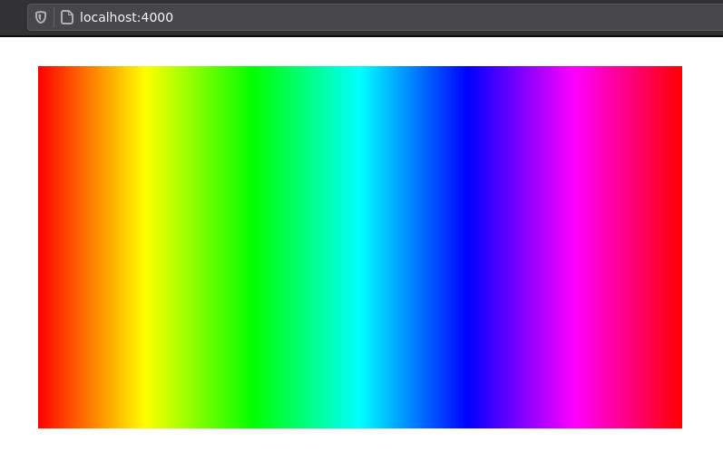
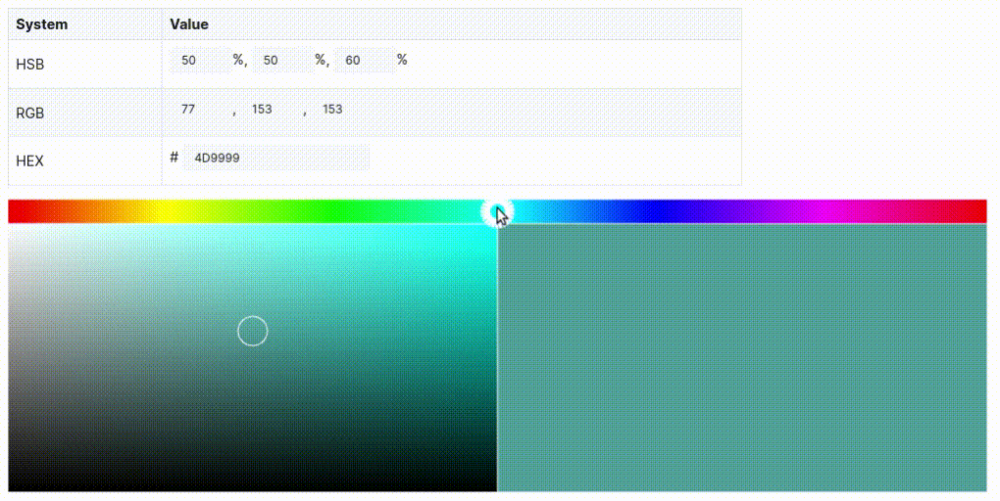

For many years now I had the idea to play with shaders in the back of my mind but I had never dared looking into it because that seemed like a very complex topic which I didn't have time to dig into. A few days ago I finally started my first project using shaders and I want to share this experiment, both for documenting purpose so that I can build on top of that in future projects but also to show that it can be fairly easy to some satisfying results.

If you have some basic understanding of how [p5js](https://p5js.org/) works your shouldn't have trouble following this article. If you never used p5js, you should now it is a nice Javascript library for creative coding which allows you to draw in a HTML canvas, and you also should be able to follow what's coming next.

As this is my first time playing with shaders there are clearly a lot of things I don't know yet and I may have made some obvious mistakes (if you spot them please point them out to me). My goal here is not to show how to create the best possible graphic project but to give you a taste of how it is possible to use shaders in your browser and how to get started. At the end of the article I list a bunch of resources which should be useful to anyone curious to use shaders in their projects.

The source code of the project is [on Github](https://github.com/statox/color-picker) and a demo is hosted on [this Github page](https://statox.github.io/color-picker/).

My goal was to create a color picker as one could find if they [duck "color picker"](https://duckduckgo.com/?t=canonical&q=color+picker) because this is a simple graphical application which doesn't require complex math or 3D understanding. So that's what we will be building today.

Before we begin here is a very quick reminder of what a shader is:

> A shader is a small program that runs entirely on your graphics card (GPU) rather than on your processing unit (CPU). It is executed in parallel for all the pixels which should be rendered making it very fast to draw on the screen. The shader is responsible for deciding which color each pixel should be.

### A first color picker without shader

To start working with shaders I wanted to keep things as simple as possible and I believe using [p5js](https://p5js.org/) is a great way to achieve that. I was already familiar with this framework and it makes it very easy to get going with a project. The cool thing with p5js is that we can start implementing our code in Javascript and then drop in the replacement for the particular areas we want to use a shader on.

So I first created a simple fully javascript version on codepen. This was the opportunity for me to learn how [the HSB color system](https://en.wikipedia.org/wiki/HSL_and_HSV) works:

<p class="codepen" data-height="265" data-theme-id="dark" data-default-tab="js,result" data-user="statox" data-slug-hash="poRKpEb" style="height: 265px; box-sizing: border-box; display: flex; align-items: center; justify-content: center; border: 2px solid; margin: 1em 0; padding: 1em;" data-pen-title="Color picker">
  <span>
  See the Pen <a href="https://codepen.io/statox/pen/poRKpEb">Color picker</a>
  by Adrien Fabre (<a href="https://codepen.io/statox">@statox</a>)
  on <a href="https://codepen.io">CodePen</a>.
  </span>
</p>
<script async src="https://cpwebassets.codepen.io/assets/embed/ei.js"></script>

This first version isn't that bad but is it extremely slow! The `draw()` function (which is the main loop executed for each frame) has a nested `for` loop iterating on each pixels of the area showing the color gradient to define which color should have the pixels. This gets pretty expensive when this area becomes bigger. That's when using a shader will become interesting: That will allow us to write a program which will be executed for each pixels in parallel on the GPU and will draw the pixels with the right color. I expect this to result in a much more fluid interface, with no latency between moving the mouse and see the new color on screen.

_Note that one could have used the [`pixels`](https://p5js.org/reference/#/p5/pixels) feature of p5js to manipulate the pixels directly rather than creating points as I'm doing in my first version. That would be more efficient and might give a satisfying result for a simple color picker, but still it's not as fun a discovering shaders._

This first version allowed me to define the 3 main areas that I want to render with a shader:

-   The rainbow: This is the line on the top which allows the user to change the hue of the current color;
-   The picker: The rectangle on the left with a gradient on the current hue, the user will be able to choose a specific saturation and brightness by clicking there;
-   The sample: The rectangle on the right which shows the currently selected color.


### A quick word about HSB

Before starting to dig into the code it's better to understand the color system we'll be using in this article: The HSB color system!

There is nothing too complex about it, and [this website](https://learnui.design/blog/the-hsb-color-system-practicioners-primer.html) does a great job at explaining in details how it works. Here are a few points to keep in mind:

-   **HSB** stands for **H**ue, **S**aturation and **B**rightness.
-   The hue value represent the raw color. It is expressed as an angle as shown on the color wheel here. This angle is between `0`-`360` degrees, but in a p5 sketch we map these values to the range `0`-`100`, and in a shader we will map it in the range `0.0`-`1.0`. But no matter which range we use the relative difference between the color is always the same.
    
    <center>
        <i>Color wheel borrowed from <a href="https://learnui.design/blog/the-hsb-color-system-practicioners-primer.html">this site</a></i>
    </center>
-   The saturation is how rich the color is: A 100% saturation is very colorful while a 0% saturation is grey. With a 0% saturation no matter which hue you use you will always get the same grey

    <p class='color-line'>
      <span class='color-block text-black' style='background-color: hsl(0, 0%, 50%)'>0%</span>
      <span class='color-block text-black' style='background-color: hsl(0, 25%, 50%)'>25%</span>
      <span class='color-block text-black' style='background-color: hsl(0, 50%, 50%)'>50%</span>
      <span class='color-block text-white' style='background-color: hsl(0, 75%, 50%)'>75%</span>
      <span class='color-block text-white' style='background-color: hsl(0, 100%, 50%)'>100%</span>
    </p>
    <p class='color-line'>
      <span class='color-block text-black' style='background-color: hsl(230, 0%, 50%)'>0%</span>
      <span class='color-block text-black' style='background-color: hsl(230, 25%, 50%)'>25%</span>
      <span class='color-block text-black' style='background-color: hsl(230, 50%, 50%)'>50%</span>
      <span class='color-block text-white' style='background-color: hsl(230, 75%, 50%)'>75%</span>
      <span class='color-block text-white' style='background-color: hsl(230, 100%, 50%)'>100%</span>
    </p>

-   The brightness is how... bright is your color? Simply put: 0% brightness is complete black no matter the hue, 100% is white if saturation is 0% or just a very bright color.
    <p class='color-line'>
      <span class='color-block text-white' style="background-color: hsl(0, 100%, 0%)">0%</span>
      <span class='color-block text-white' style="background-color: hsl(0, 100%, 25%)">25%</span>
      <span class='color-block text-white' style="background-color: hsl(0, 100%, 50%)">50%</span>
      <span class='color-block text-black' style="background-color: hsl(0, 100%, 75%)">75%</span>
      <span class='color-block text-black' style="background-color: hsl(0, 100%, 100%)">100%</span>
    </p>
    <p class='color-line'>
      <span class='color-block text-white' style="background-color: hsl(230, 100%, 0%)">0%</span>
      <span class='color-block text-white' style="background-color: hsl(230, 100%, 25%)">25%</span>
      <span class='color-block text-white' style="background-color: hsl(230, 100%, 50%)">50%</span>
      <span class='color-block text-black' style="background-color: hsl(230, 100%, 75%)">75%</span>
      <span class='color-block text-black' style="background-color: hsl(230, 100%, 100%)">100%</span>
    </p>

Note that you'll also find online some references to the color systems **HSV** and **HSL**. If I believe the wikipedia page **HSV** is the exact same thing as **HSB** excepted **B**rightness is named **V**alue. And **HSL** is **H**ue, **S**aturation, **L**ightness which is kind of the inverse of Brightness (if you want details, check wiki they explain it better than I'll do).

### Our first shader

Now that we know what our project should look like and we understand our color system let's get started with shaders! The first step is to use a very basic shader in a p5js project. Fortunately the doc gives [a good example](https://p5js.org/examples/3d-basic-shader.html) of a very simple usage:

```javascript
// this variable will hold our shader object
let theShader;

function preload() {
    // load the shader
    theShader = loadShader('assets/basic.vert', 'assets/basic.frag');
}

function setup() {
    // shaders require WEBGL mode to work
    createCanvas(710, 400, WEBGL);
    noStroke();
}

function draw() {
    // shader() sets the active shader with our shader
    shader(theShader);

    // rect gives us some geometry on the screen
    rect(0, 0, width, height);
}
```

This will use a shader named `basic` to draw a rectangle on screen. The interesting part is then to implement this shader. As we can see in the `loadShader()` call we need 2 files to define a shader:

-   `shader.vert`
-   `shader.frag`

These files are written with [GLSL](https://en.wikipedia.org/wiki/OpenGL_Shading_Language) which is a widely used language to program shaders, this is the language we will use the shader files in the articles.

My basic understanding is that the `vert` file is used to calculate the screen position of the different vertexes (i.e. points forming the shape) we want to draw. This comes in pretty useful when one needs to draw a 3D shape, but that also considerably increases the complexity of the shader. For now we will focus only on 2D drawings, so our `vert` file will be pretty simple and it will be the same in all of the shaders we will talk about in the rest of this article. It looks like this:

```glsl
/*
 * vert file and comments from adam ferriss
 * https://github.com/aferriss/p5jsShaderExamples
 * with additional comments from Louise Lessel
 */

// We'll not pay attention to that in this article. This change the precision
// on the numbers we use.
precision highp float;

// This “vec3 aPosition” is a built in shader functionality.
// You must keep that naming.
// It's automatically used by p5 to set the position of every vertex on your canvas
attribute vec3 aPosition;

// We always must do at least one thing in the vertex shader:
// tell the pixel where on the screen it lives:
void main() {
  // copy the position data into a vec4, using 1.0 as the w component
  vec4 positionVec4 = vec4(aPosition, 1.0);

  // Make sure the shader covers the entire screen:
  // scale the rect by two, and move it to the center of the screen
  // if we don't do this, it will appear with its bottom left corner
  // in the center of the sketch
  positionVec4.xy = positionVec4.xy * 2.0 - 1.0;

  // Send the vertex information on to the fragment shader
  // this is done automatically, as long as you put it into the built in
  // shader variable “gl_Position”
  gl_Position = positionVec4;
}
```

As you can see from the comments I didn't write this code: I ~~stole~~ borrowed it from [this amazing github](https://github.com/aferriss/p5jsShaderExamples). I won't go too much into details because really all this file does is take the position of a pixel `aPostion` translate its `x` and `y` components to the top left corner —this is necessary given how p5js and shaders work together— and send this position via the `gl_Position` to the `frag` file.

All the fun will happen in the `frag` file which is responsible for drawing the pixel with the right color at the position it is given. Let's begin with a very unexciting `frag` which draws all the pixels in red:

```glsl
precision highp float;

void main() {
    // gl_FragColor is a built in shader variable,
    // and your .frag file must set it
    // We are setting the color into a new vec4, with a transparency of 1 (no transparency)
    gl_FragColor = vec4(1.0, 0.0, 0.0, 1.0);
}
```

In a `frag` file you must set the `gl_FragColor` variable: This will tell the shader which color to use for the current pixel and that will stop the execution of the `main()` function. The `gl_FragColor` takes four components `R` (red), `G` (green), `B` (blue), `A` (alpha), which is a common way to describe a color with the [RGBA color system](https://en.wikipedia.org/wiki/RGBA_color_model). Note that usually the `RGB` components range between `0` and `255` but in a shader all values range between `0.0` and `1.0`, that's why red is `1.0, 0.0, 0.0` (and blue would be `0.0, 0.0, 1.0`)



The result is a simple red rectangle but it is drawn by the GPU, we are heading the right way! We will be able to reuse this shader in the "sample" section of the color picker by passing the components of the color to the shader. We will see how to pass values to the shader in the next part.

### Rainbows 🌈

Our red rectangle quickly becomes boring so let's work on our rainbow area which will allow to choose the hue of the color in the sample. To do so we will keep the same `vert` file but we will change the `frag` file a bit:

```glsl
precision highp float;

// This is a uniform value passed by p5 which will allow us to
// scale the drawing properly
// It contains the full size of the drawn area in a 2D vector
uniform vec2 u_resolution;

// In the p5 sketch we work with HSB colors because they are easier to use when
// creating a gradient, but shaders only take RGB colors
// This function takes a 3D vector [H, S, B] and returns a 3D vector [R, G, B]
// https://gist.github.com/yiwenl/745bfea7f04c456e0101
vec3 hsb2rgb(vec3 c)
{
    vec4 K = vec4(1.0, 2.0 / 3.0, 1.0 / 3.0, 3.0);
    vec3 p = abs(fract(c.xxx + K.xyz) * 6.0 - K.www);
    return c.z * mix(K.xxx, clamp(p - K.xxx, 0.0, 1.0), c.y);
}

void main() {
    // Normalize the position (to be in range 0.0 - 1.0)
    // The .xy notation applies the same operation on both x and y components
    vec2 st = gl_FragCoord.xy/u_resolution.xy;

    // Use the x position of the pixel to define its hue
    // (with saturation and brightness to 1)
    // Then convert the HSB color to RGB
    vec3 color = hsb2rgb(vec3(st.x, 1, 1));

    // Color the pixel
    gl_FragColor = vec4(color, 1.0);
}
```

Here the code gets a bit more interesting. First we pass a uniform `u_resolution`, this is a variable which will have the same value for all the pixels. This uniform holds the size of the shape drawn in the page and it is sent to the shader with the p5js function [`setUniform()`](https://p5js.org/reference/#/p5.Shader/setUniform). It is used in the `main()` function to normalize the `gl_FragCoord` variable and store this normalized position in `st` (which is a standard name to do this).

We can then use the `x` component of the normalized position to define the color of the pixels. I reused a helper function I found [on Github](https://gist.github.com/yiwenl/745bfea7f04c456e0101) to convert HSB to RGB.

Now all we need is to add the uniform to our `draw()` function:

```javascript
function draw() {
    // shader() sets the active shader with our shader
    shader(theShader);

    // Set the resolution as a uniform
    theShader.setUniform('u_resolution', [p5.width, p5.height]);

    // rect gives us some geometry on the screen
    rect(0, 0, width, height);
}
```

Aaand: 🌈 RAINBOW 🌈



### The picker

We now know how to create a plain color rectangle and a rainbow rectangle, the last thing we need to draw with a shader is our "picker" rectangle. This area will show a gradient of color: We will use the same hue for the whole space but we will change the brightness along the y axis and the saturation along the x axis. Again the `vert` file doesn't change and the `frag` file will be very similar to the one for the rainbow shader:

```glsl
precision highp float;

// Resolution to scale the drawing
uniform vec2 u_resolution;
// The hue currently selected by the user
uniform float u_hue;

// https://gist.github.com/yiwenl/745bfea7f04c456e0101
vec3 hsb2rgb(vec3 c)
{
    vec4 K = vec4(1.0, 2.0 / 3.0, 1.0 / 3.0, 3.0);
    vec3 p = abs(fract(c.xxx + K.xyz) * 6.0 - K.www);
    return c.z * mix(K.xxx, clamp(p - K.xxx, 0.0, 1.0), c.y);
}

void main() {
    // Normalize the position between 0 and 1
    vec2 st = gl_FragCoord.xy/u_resolution.xy;

    // Set the pixel color using the current hue
    // and the position to make a gradient
    vec3 color = hsb2rgb(vec3(u_hue, st.x, st.y));

    // Color the pixel
    gl_FragColor = vec4(color, 1.0);
}
```

The principle is very similar to the rainbow shader, two things change:

-   First we pass new uniform `u_hue` which determines the hue selected by the user. This hue is passed as a float ranging from `0.0` to `1.0` by the p5 sketch.
-   Then we use this hue as well as the normalized position to get the color of the pixel.

In the `draw()` function we will use the following line to set the hue depending on the x component of the mouse position:

```javascript
// map mouseX from range 0-width to range 0-1
theShader.setUniform('u_hue', [map(mouseX, 0, width, 0, 1)]);
```

And here is our result!


<center>
    <i>Don't be fooled by the potato 🥔 quality of my screencap, the actual webpage doesn't have these ugly artifacts.</i>
</center>

### Making a complete color picker

Now comes the part where we put everything together to get a working color picker. We don't need to change the shader files anymore we will just edit the p5 sketch to get the user inputs and draw what we need accordingly.

The user will have two ways to interact with the picker:

-   When they click on the rainbow and move the mouse on it we will update the hue used in the picker rectangle.
-   When they click the picker and move the mouse on it we will update the saturation and brightness.

Each change in hue, saturation or brightness will be reflected in the sample rectangle showing the currently selected color.

First we will update the `preload()` function to load the 3 different shaders:

```javascript
function preload() {
    // Uniform color used for the sample rectangle
    uniformShader = loadShader('shader/uniform.vert', 'shader/uniform.frag');
    // Saturation and brightness gradient for the picker rectangle
    pickerShader = loadShader('shader/picker.vert', 'shader/picker.frag');
    // Hue gradient for the rainbow rectangle
    rainbowShader = loadShader('shader/rainbow.vert', 'shader/rainbow.frag');
}
```

So now that we have three different shaders in the sketch things will get a bit more complex than before. Given our previous draw function I was tempted to do something like this:

```javascript
function draw() {
    // Draw the sample
    shader(uniformShader);
    rect(/* sample coordinates */);

    // Draw the picker
    shader(pickerShader);
    rect(/* picker coordinates */);

    // Draw the rainbow
    shader(rainbowShader);
    rect(/* rainbow coordinates */);
}
```

But that doesn't work, instead we will need to use a buffer canvas in which we will draw with the shader offscreen. Then we will use this as a texture for the rectangles we will draw on the canvas onscreen.

That sounds a bit barbarian but in practice it's not that bad.

First we need to update `setup()` to create these buffers and give them the dimensions of our future rectangles to draw:

```javascript
function setup() {
        // Create the actual canvas where we will draw our rectangles
        createCanvas(PICKER_WIDTH + SAMPLE_WIDTH, TOTAL_HEIGHT, WEBGL);

        // Setup colormode to use HSB (This only impacts p5js not the shaders)
        colorMode(HSB, 100);

        /*
         * initialize the createGraphics layers
         */
        // Create a buffer canvas
        uniformGraphics = createGraphics(SAMPLE_WIDTH, height, WEBGL);
        // Set the shader to be used in this buffer
        uniformGraphics.shader(uniformShader);

        pickerGraphics = createGraphics(PICKER_WIDTH, height - BOX_TOP_HEIGHT, WEBGL);
        pickerGraphics.shader(pickerShader);

        rainbowGraphics = createGraphics(width, BOX_TOP_HEIGHT, WEBGL);
        rainbowGraphics.shader(rainbowShader);
    };
}
```

Now in `draw()` let's draw our sample rectangle:

```javascript

function draw() {
    // Some magic to get the hue, saturation and brightness in
    // the variables h, sPicker and bPicker
    ...

    /*
     * Draw the sample rectangle
     */
    // Pass the current hue, saturation and brightness as an uniform to the shader
    uniformShader.setUniform('u_color', [h / 100, sPicker / 100, bPicker / 100]);
    // Draw a rectangle using the shader in the buffer canvas (offscreen)
    uniformGraphics.rect(PICKER_WIDTH, BOX_TOP_HEIGHT, SAMPLE_WIDTH, height - BOX_TOP_HEIGHT);
    // Instruct p5 to use what was drawn offscreen in the buffer as a texture
    texture(uniformGraphics);
    // Draw (onscreen) the rectangle, using the texture
    rect(PICKER_WIDTH, BOX_TOP_HEIGHT, SAMPLE_WIDTH, height - BOX_TOP_HEIGHT);
}
```

With that we get the same result as our first example i.e. a simple plain rectangle. We can reuse the sample principle to draw our two other rectangles:

```javascript
function draw() {
    // Some magic to get the hue, saturation and brightness in
    // the variables h, sPicker and bPicker
    ...

    // Draw the sample rectangle as before
    ...

    // Draw the picker rectangle
    pickerShader.setUniform('u_resolution', [PICKER_WIDTH, p5.height - BOX_TOP_HEIGHT]);
    pickerShader.setUniform('u_hue', h / 100);
    pickerGraphics.rect(0, 0, PICKER_WIDTH, p5.height - BOX_TOP_HEIGHT);
    p5.texture(pickerGraphics);
    p5.rect(0, BOX_TOP_HEIGHT, PICKER_WIDTH, p5.height - BOX_TOP_HEIGHT);

    // Drawn the rainbow rectangle
    rainbowShader.setUniform('u_resolution', [p5.width, BOX_TOP_HEIGHT]);
    rainbowGraphics.rect(0, 0, p5.width, BOX_TOP_HEIGHT);
    p5.texture(rainbowGraphics);
    p5.rect(0, 0, p5.width, BOX_TOP_HEIGHT);
}
```

And here we are!


Now adding a bit of logic in our sketch to detect when the user clicks on the screen and convert the mouse position into the HSB values, doing some additional conversions to get the RGB and hex values corresponding to the current selection and putting all of that in a terribly bad looking UI and we have a complete color picker:



An online demo is available [here](https://statox.github.io/color-picker/), it doesn't work very well on my iPhone but it looks like it's ok on both Firefox and Chromium.

### A new world of opportunities

This project was really fun to do and I hope that if you never played with shaders before it gave you some inspiration to do the same! I am really excited to use this new skill I learned because I've done [a few](https://www.statox.fr/posts/2020/11/ants/) [simulations](https://www.statox.fr/posts/2020/09/boids/) in the browser with p5 before but they were all limited by their performances. Offloading some of the work to the GPU should allow me to create simulations with much larger definitions. I'm thinking about trying to make a [Critters cellular automaton](<https://en.wikipedia.org/wiki/Critters_(cellular_automaton)>), exploring [fractal](https://www.shadertoy.com/view/lsX3W4) or maybe maps generation as seen in some of [Sebastian Lague's videos](https://www.youtube.com/channel/UCmtyQOKKmrMVaKuRXz02jbQ).

If you also want to get started with shaders here is a list of some interesting resources:

-   [itp-xstory.github.io](https://itp-xstory.github.io/p5js-shaders) - An amazing introduction to using shaders with p5js
-   [aferriss/p5jsShaderExamples](https://github.com/aferriss/p5jsShaderExamples) - Some useful examples of GLSL shaders for p5js
-   [p5js.org](https://p5js.org/reference/#/p5/shader) - The p5js doc about shaders
-   [lea.codes](https://lea.codes/webgl/) - The personal website of a dev who does cool things with shaders and threejs
-   [The book of shaders](https://thebookofshaders.com/) - The Bible of shader programming

If you know of other good resources or want to discuss a project idea, leave a comment on this article!

<!-- vim: set spell: -->
