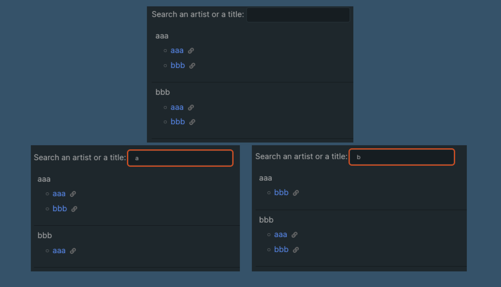
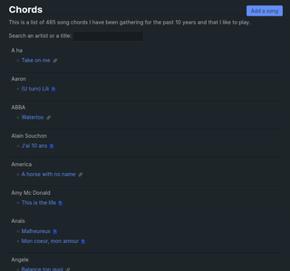

**EDIT January 2024** The page I mention in this post does not exists anymore. I moved this song book to [my apps website](https://apps.statox.fr/songbook) to benefit from a full JS environment as the static setup of this blog was limiting the features I wanted to develop. The method I describe here though is still valid for eleventy websites.

Recently I added to my website [a page]({{'/chords' | url}}) listing the chords of the songs I like to play on the guitar. This is useful for me to centralize all these bookmarks I had scattered over the years but since the list has almost 500 entries I also wanted to implement a search bar which would allow me to search for a song by its artist and by its title.

Implementing this search feature was a good opportunity to learn a thing or two about front end technologies and also to create yet another dirty feature, just for fun. I ended up with an implementation using less than 10 lines of javascript and bit of CSS. In this post I'll explain how I did it because I'm happy with the result.

_**An important note:** This is just a pet project and I'm a backend engineer. My solution is dirty, and I wouldn't recommend using it for anything in production. It might give you some idea if you have a personnal website on which you want to add a very simple and limited search feature though._

### The setup

I'm building this website with the static site generator [eleventy](https://www.11ty.dev/) and I use the [nunjucks](https://mozilla.github.io/nunjucks/) template language by Mozilla to create my templates. With eleventy you have the possibility to create some "data files" which are made available to your templates. So after collecting all my links, I put them in a [json file](https://github.com/statox/blog/blob/83c9fd3/src/_data/chords.json) that I added to my repo. This file is dead simple: it holds an array of items with three fields `artist`, `title` and `url` linking to the page of the chords:

```json
[
    {
        "artist": "Kenny Rogers",
        "title": "The Gambler",
        "url": "https://tabs.ultimate-guitar.com/tab/kenny-rogers/the-gambler-chords-627779"
    },
    {
        "artist": "The Beach Boys",
        "title": "Surfin' USA",
        "url": "https://www.boiteachansons.net/Partitions/The-Beach-Boys/Surfin-USA.php"
    },
    ...
]
```

_I am also in the process of adding a `creationDate` field so that I can have more sorting options for this page, but that is still a work in progress._

Now that the list is available to my templates I created a new nunjucks template to show all my songs:



```jinja2

<table>
    
    <tr>
        <td class="artist">{{artist}}
            <ul>
                
                <li>
                    {# Some omitted logic to define iconClass #}
                    {# based on the type of document linked by chord.url #}
                    <span>
                        <a href="{{chord.url}}">{{chord.title}}</a>
                        &nbsp<span class="{{iconClass}}"></span>
                    </span>
                </li>
                
            </ul>
        </td>
    </tr>
    
</table>
```



There is nothing particularly clever here: In the first line `chords` is the raw data coming from the JSON file. `sortChords` is [an eleventy filter I wrote](https://github.com/statox/blog/blob/83c9fd3/tools/eleventy/filters.js#L96-L103) which sorts the data alphabetically by artist and by title. And the `groupby("artist")` nunjucks [buit-in filter](https://mozilla.github.io/nunjucks/templating.html#groupby) takes all the data and turns it into a map where the keys are the artist names and the values are lists of the items from the json file.

Once I have my data available I can use a nunjucks loop `` to iterate on all the keys of the map (the artists). For each artist I add a new row in an html table and in this row I can add an unordered list of the songs with a second loop ``.

This is what it looks like with some additional CSS:

 

### The search

I'm happy with my list of 500 songs but it's not super easy to navigate: I need to scroll all the way to the song I want to play. To fix that I want to add a search bar in which I can input some text and the list will only show the entries for which the artist name or the song title will match what I wrote.

I'm sure there are a lot of clever ways to do that but I decided to go with the inefficient and dirty way:

-   Create a text input;
-   Use its `oninput` property to call a short javascript function;
-   The javascript function will iterate over all the HTML elements and add a `.hidden` CSS class to the ones which don't match the query.

#### CSS

The first easy step is to create the `.hidden` class in a dedicated css file. When an element has this class its `display` attribute is set to `none` making it disappear from screen.

```css
.hidden {
    display: none;
}
```

#### Input

The input element is super basic too:

```html
<input id="searchInput" type="text" oninput="doSearch()" />
```

I used the `oninput` property instead of `onchange` because I want to see the songs filtered as I type and not when I'm done typing. That makes the search bar more convenient on mobile.

#### Adding data to the HTML elements

Before I can create the function to filter the HTML elements I need to bind some data to these elements. At first I was thinking about going really dirty and using the actual content of my HTML tags, but that wasn't super convenient and I stumbled upon [HTML data attributes](https://developer.mozilla.org/en-US/docs/Learn/HTML/Howto/Use_data_attributes) which is a HTML5 feature allowing to associate some data to an element.

Here I have two types of elements I want to show/hide:

-   The `<tr>` rows which holds the artist and their songs;
-   The `<li>` items which holds only the song titles.

And I want the search to act independently on each type of element: If an artist matches my search I want to see all of their songs and I also want to see all of the songs which title matches the search:

 

To make that work I decided to add different data for each type of element:

-   For both the artist `<tr>` and the song `<li>` I put in the data attribute the name of the artist;
-   For the artists `<tr>` I add all the concatenated titles of their songs;
-   For the song `<li>` I add only the song title;

I put all of this data in a `data-values` attribute and I used nunjucks loops once again to concatenate what needs to be concatenated. I also add a `;` separator between each value so that I'm sure the search will not overlap two different entries:



```jinja2

<table>
    
    <tr class="datarow" data-values="{{artist}};{{ chord.title}};">
        <td class="artist">{{artist}}
            <ul>
                
                <li class="datarow" data-values="{{artist}};{{ chord.title}}">
                    {# Some omitted logic to define iconClass #}
                    {# based on the type of document linked by chord.url #}
                    <span>
                        <a href="{{chord.url}}">{{chord.title}}</a>
                        &nbsp<span class="{{iconClass}}"></span>
                    </span>
                </li>
                
            </ul>
        </td>
    </tr>
    
</table>
```



I also added a CSS class `datarow` to both the `<tr>` and `<li>`. This is the selector I'll be using in my javascript to find the elements I need to manipulate in my page.

#### The search function

Finally a few lines of javascript to make the magic happen:

```javascript
function doSearch() {
    // Get the string entered by the user in the input element
    const searchStr = document.getElementById('searchInput').value;
    // List all the elements which will have to be shown/hidden
    const tableLines = document.getElementsByClassName('datarow');
    // For each element get the content of the data attribute
    // match the content against the query string
    // and change the class accordingly
    for (const line of tableLines) {
        const values = line.dataset.values;
        if (values.toLowerCase().match(searchStr.toLowerCase())) {
            line.classList.remove('hidden');
        } else {
            line.classList.add('hidden');
        }
    }
}
```

### The result

And here we have a working search bar which you can try live [on this page]({{'/chords/' | url}})! 🎉



It doesn't take an experienced web developer to see that this solution has its flaws:

-   I think that adding all this data in the data attributes increases the size of the page which is probably not great for loading times;
-   The search algorithm is quite dumb and it scans all the elements in the page, using a more efficient data structure would improve the performances;
-   I'm really not sure how this would scale with a list 10x or 100x bigger.

But for my specific use case this is working fine and as it took me ~10 years to create the list of 500 songs I don't think the size will become an issue before many more years. Also I'm fairly confident that I'd be able to reuse these pieces of code to create other search bar on my site: All I need is to have html elements with the class `.datarow` and some data to filter in their `data-value` attributes.

If you read this article I hope that it made you want to experiment with you own personal website and that it gave you the idea to test something ugly and inefficient just for fun!
