Notes about how I set up an [OpenSearch](https://docs.aws.amazon.com/opensearch-service/) cluster to manage the logs of [my api](https://github.com/statox/api.statox.fr).

Goal: Set up the cheapest ELK cluster possible to - Ingest the logs of my API - Maybe use as a tracking database for my habits

TODO:

- Review costs after some usage. The idea was to benefit from the free tier, after one week it seems I don't get it.
- Review [UltraWarm](https://docs.aws.amazon.com/opensearch-service/latest/developerguide/ultrawarm.html) nodes they might be usefull for my usage if I can't benefit from the free tier.

## Setup the cluster in AWS

Everything done easily from the AWS console. I had to use "Standard create" to be able to setup a smaller cluster than what AWS recommends because I have very small needs.

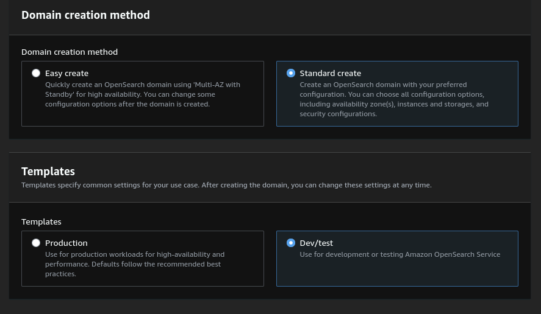

<center>
    <i>Not using the default Easy mode</i>
</center>

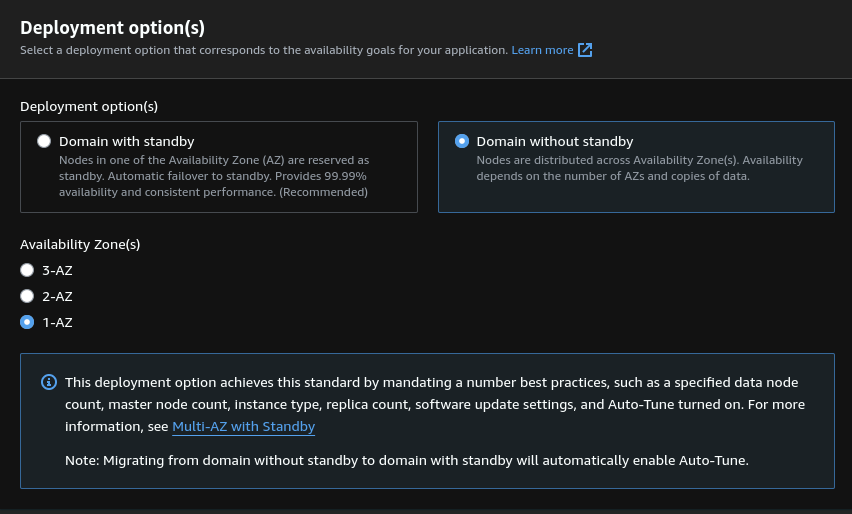

<center>
    <i>Specifying a single availability zone to limit the costs.</i>
</center>

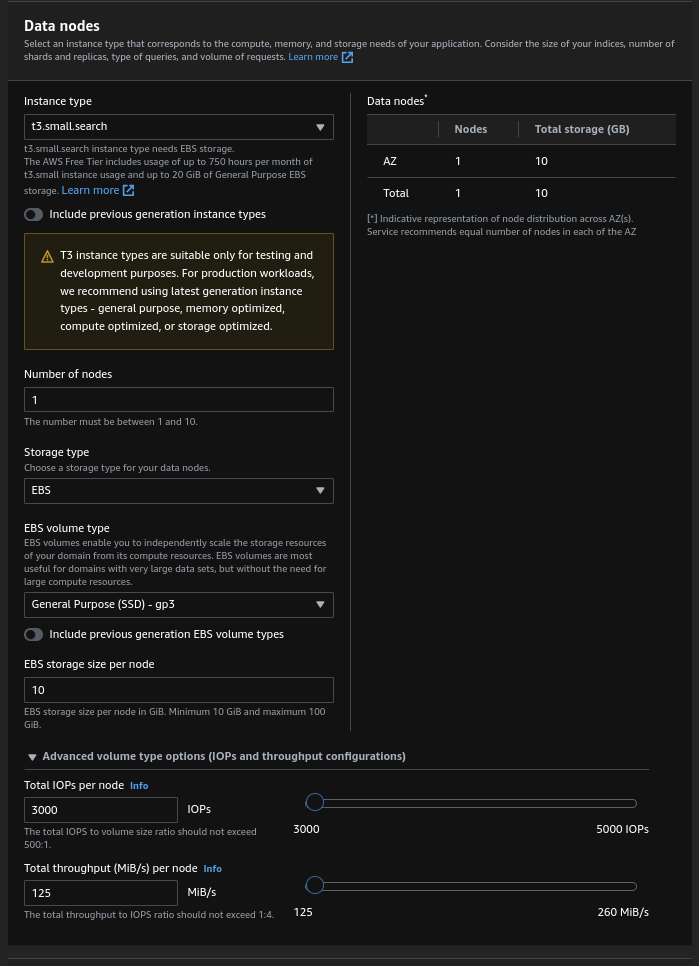

<center>
    <i>Using a single node both for master and data with the smallest possible EBS and minimum IOPS.</i>
</center>

I also set up a custom endpoint so that I can reach my cluster from logs.statox.fr instead of the default long endpoint provided by ELK. The setup is simple: Create a certicate in ACM, setup a DNS verification to validate the certificate and use the certificate in the setup screen of OpenSearch.

The security is far from ideal but pretty convenient for a very-not-critical API like mine: The cluster is open to internet and the auth is done with ELK's built-in user store. (Note that the automatic software updates are enabled thank to the managed aspect of the cluster, I'll need to make sure it doesn't break stuff when I don't do anything).

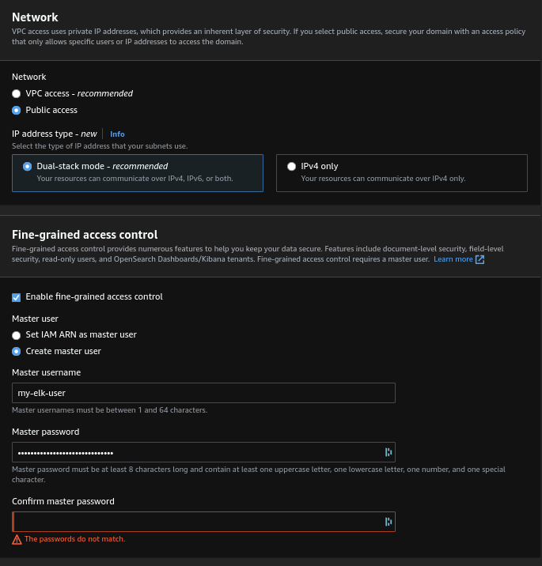

<center>
    <i>Using a single node both for master and data with the smallest possible EBS and minimum IOPS.</i>
</center>

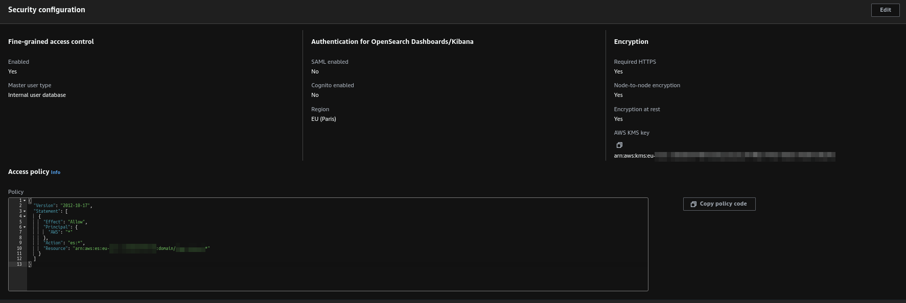

<center>
    <i>TODO: Check if I can better restrict this policy.</i>
</center>

By default the cluster has hourly snapshots. The cluster takes several minutes to start up, once it is up we can test that it answers properly:

```bash
DOMAIN_ENDPOINT='https://logs.statox.fr'
ELASTIC_USER='xxxxxxxx'
ELASTIC_PASSWORD='xxxxxxxx'


curl  -H 'Content-Type: application/json' \
      -XGET --user "$ELASTIC_USER:$ELASTIC_PASSWORD" \
      "$DOMAIN_ENDPOINT/_cat/health"
```

## About ingestion

AWS har a service [OpenSearch Ingestion](https://docs.aws.amazon.com/opensearch-service/latest/developerguide/osis-get-started.html) which provides ingestion pipeline like Logstash would do in a regular ELK setup.

For now I don't use it because I want to avoid the additional costs but this has some big downsides, particularly I need to provide a timestemp fields when my clients send new logs, that sucks and is very error prone. Also the clients are responsible for sending the logs to the correct data stream, for now this is ok because I use the cluster only for my logging but when I start using it for other features I'll probably need to get to the ingestion part.

## The UI

AWS replaces Kibana with [OpenSearch Dashboards](https://docs.aws.amazon.com/opensearch-service/latest/developerguide/dashboards.html) which is a rebranded version of Kibana. It is accessible to `https://logs.statox.fr/_dashboard`.

The main difference with a self hosted Kibana is the "Management" section of the menu which changes, for example there is no "Stack Monitoring" section because the monitoring is done directly in AWS.

## Configuring the database

Goal: Ingest my logs on a rolling index (weekly rollover)

I am going to use data steams instead of regular index to make it easier to configure the roll over.

### 1. Create the index template.

This is the template of settings which will be applied to all the indices which will be used to create the data stream.

Important settings:

- Specify that we are working with data streams
- Specify the `timestamp` field as the time field (which will allow the proper indexing and temporal search).
- We are not really using index pattern as with regular indices because we are using a data stream, so the `index pattern` property must have the name of the stream we will create later on. _Note: No \* character_

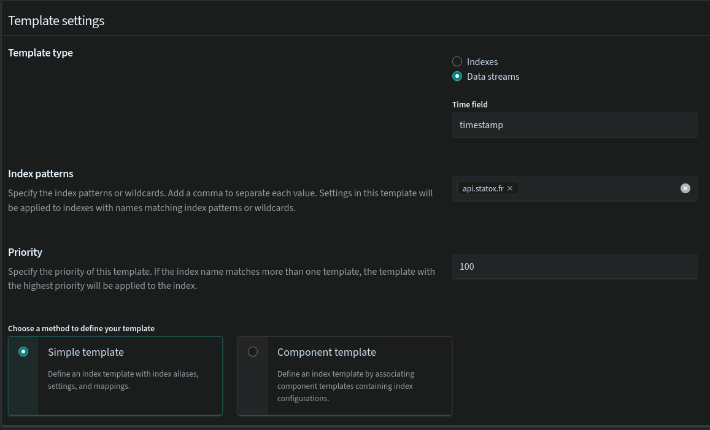

No need to specify an index alias because the data stream will take care of that. And I have only one node so it doesn't make sense to have more than one primary shard or any replica shard.

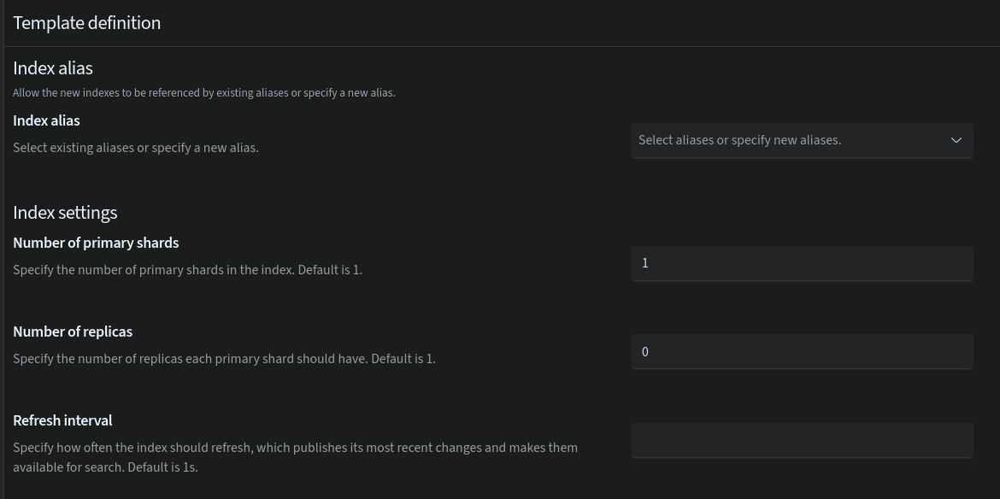

The index mapping are useful to specify that a specific field is not a simple number but a timestamp or not a simple string but an IP. See the [supported fields types](https://opensearch.org/docs/latest/field-types/supported-field-types/index/).

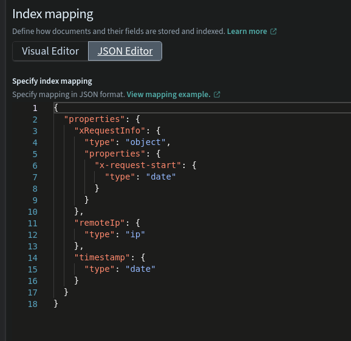

### 2. Create the data stream

If created with the name used in the index template's `index pattern` field the stream will be associated to the template.

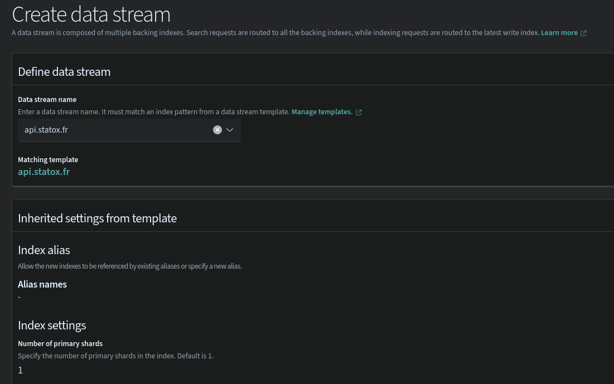

Once the stream is created we can start pushing data to it, that will automatically create the underlying index:

```bash
curl  -H 'Content-Type: application/json' -XPOST --user "$ELASTIC_USER:$ELASTIC_PASSWORD" "$DOMAIN_ENDPOINT/api.statox.fr/_doc" \
    -d '{"message": "Test message from bash", "timestamp": $(date +"%s")000}' # With a shitty hack to transform seconds to milliseconds
```

### 3. Create the Index pattern

This is the entity which tells to Dashboards (Kibana) which indices to search when you are in the `Dicover` tab.

The only thing needed when creating the pattern is to use the proper name `api.statox.fr` (Again no need for `*` thanks to the data stream which masks the complexity)

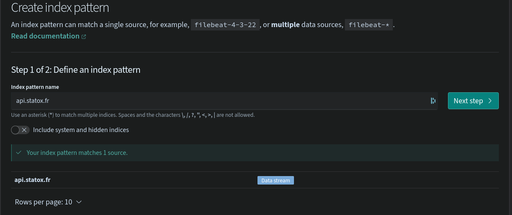
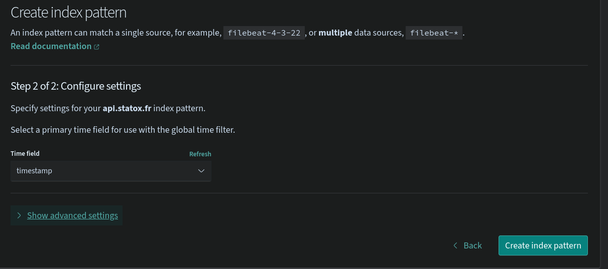

From there the logs are available in the `Discover` tab:

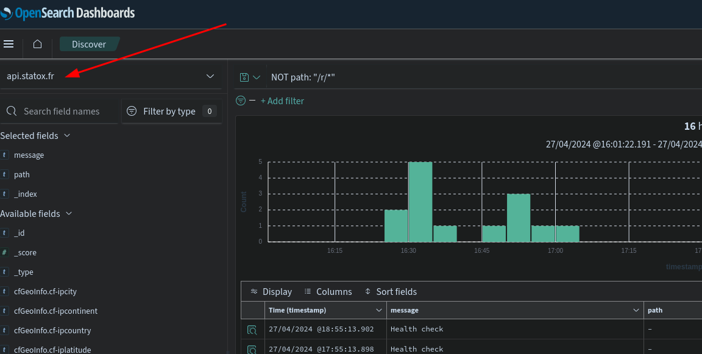

### 4. Set up the index policy

This is the final step to make sure the indices backing the data streams are regularly rotated (so that at one point they can be deleted to keep the volume of data below a certain threshold without dropping a unique index with all the logs).

An optional step 1 is to setup a Notification channel to be notified when the policy fails, settings up a notification on a slack webhook is super straight forward, just past the webhook URL and you're done.

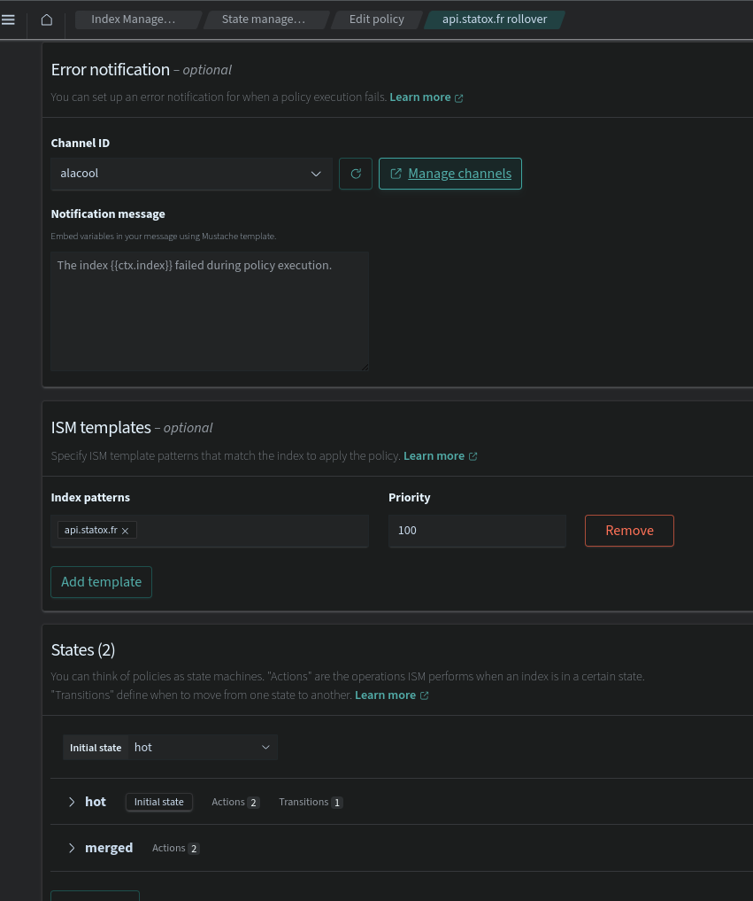

By using the correct index pattern, the policy will be applied to all the indices of the data stream and will rollover them.

## Conclusion

This kind of setup is something I'm used to do on a much bigger scale in my day job so I see the cracks in this current setup but at least it's working conveniently for my small needs.

- It would be great to terraform the AWS part (but, _la flemme_)
- I need to check if I can easily restore the automatic snapshots made by AWS and if that keeps the configurations I did in Kibana (in theory, yes)
- Next I'll use this document store as part of the product of my api.
