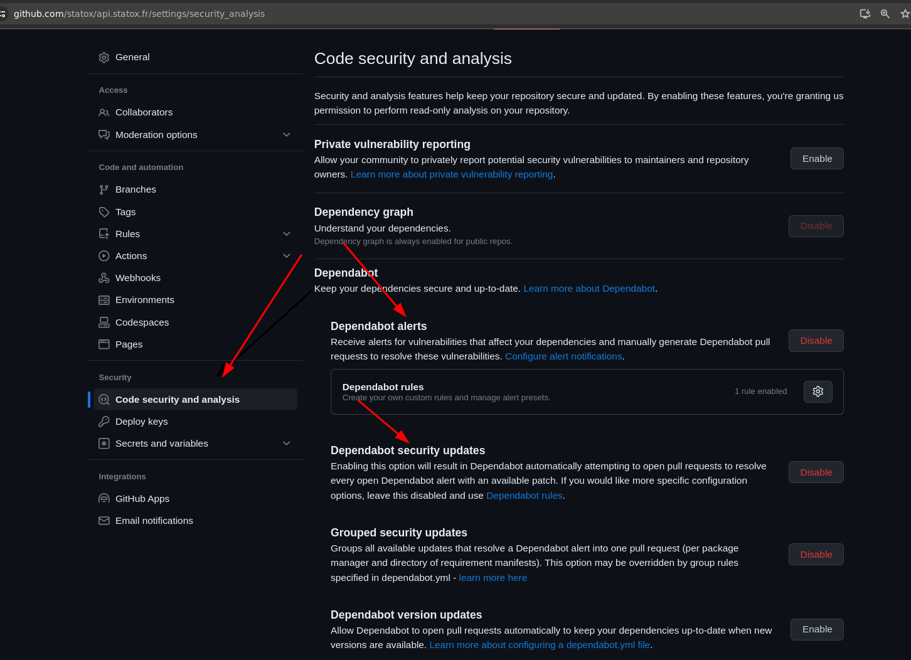
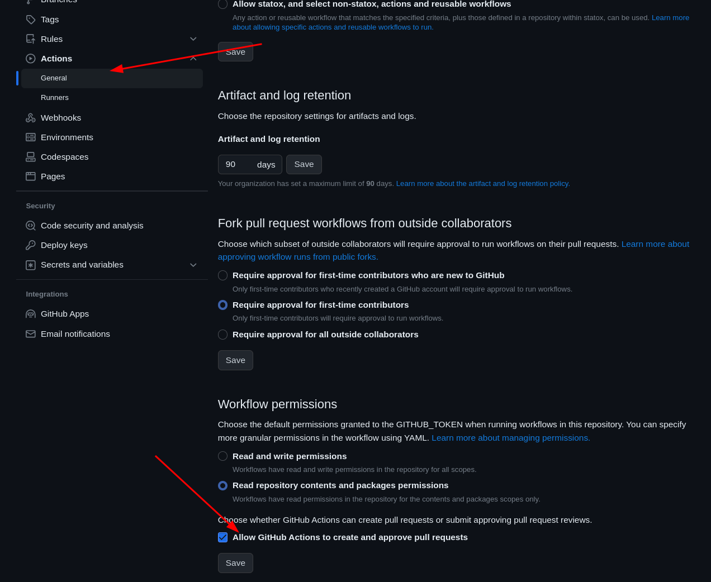
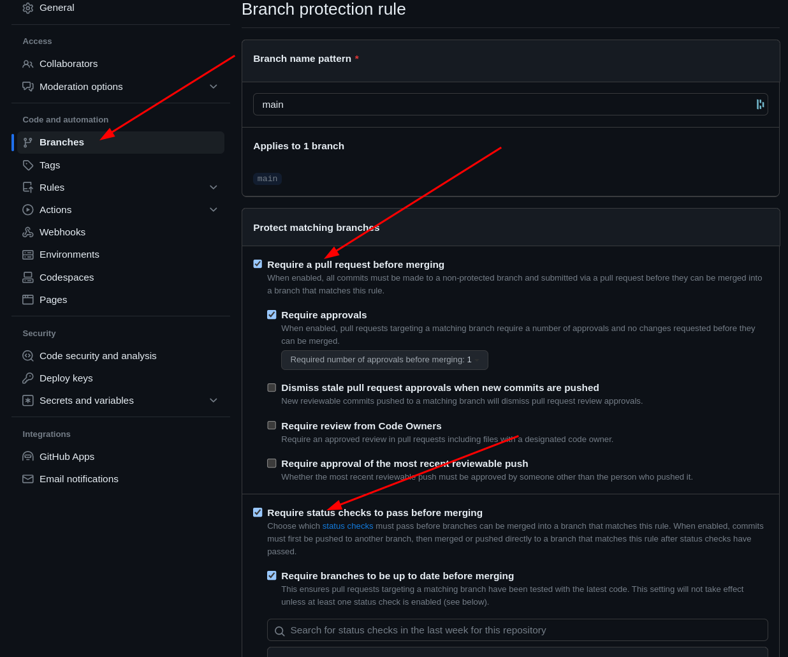
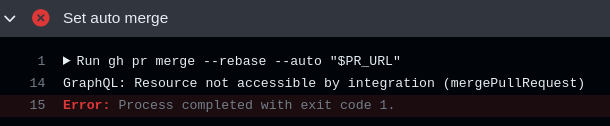
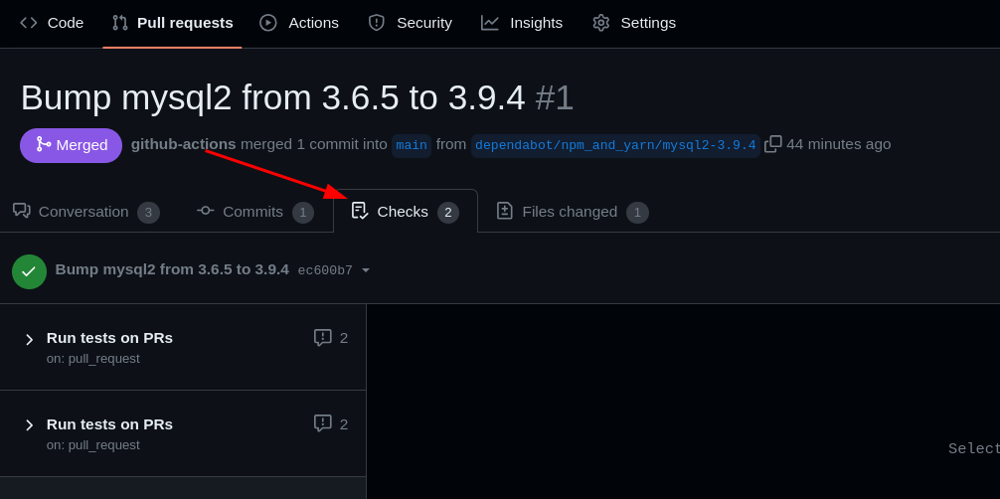
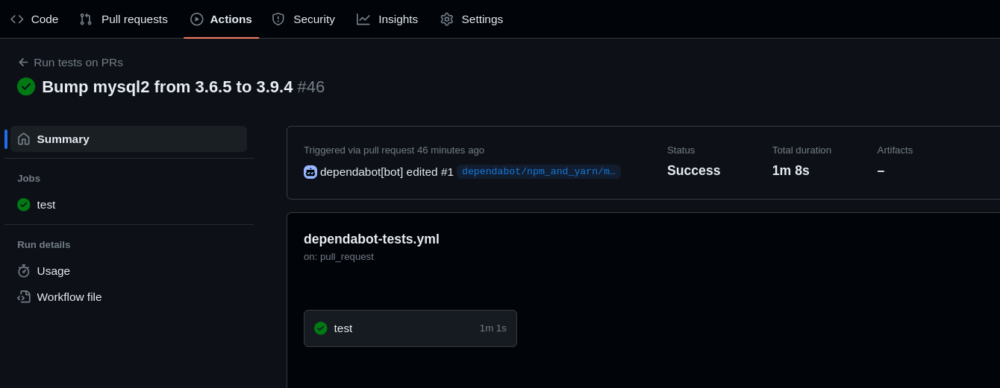
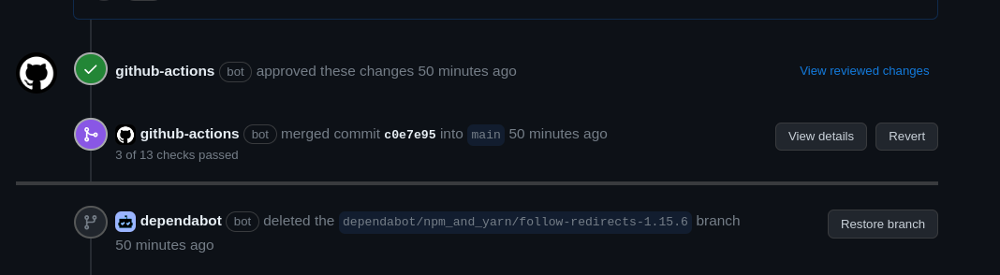

I have Dependabot set on many of my repos but I often get too lazy to check the PRs and merge them. On [my api](https://github.com/statox/api.statox.fr) repo this is an issue because I really want to keep dependencies up to date. Here is what I did to have Dependabot's PRs merged automatically as they are created.

The file lives [there on Github](https://github.com/statox/api.statox.fr/blob/main/.github/workflows/dependabot-auto-merge.yml)

**At no point there is a need to generate a github access token by yourself. Dependabot will use its own**

## Setup tests

For my api repo I use `mocha` to run the tests. I have 3 commands to be able to run the tests

```bash
npm run env            # This triggers a podman-compose command starting the containers
./src/tools/init-db.sh # Create the test database in the container
npm run tests:all      # Call mocha and run the tests
```

## Setups in Github

### Dependabot

Allow Dependabot to regularly create PRs with dependencies update.

In the Github repo settings: Security > Code security and analysis > Dependabot



<center>
    <i>Enable the Dependabot alerts</i>
</center>

For better configuration a file `github/dependabot.yml` can be created in the repo, see [the doc](https://docs.github.com/en/code-security/dependabot/dependabot-version-updates/configuration-options-for-the-dependabot.yml-file) for more details.

### Actions settings

Allow GitHub Actions to create and approve pull requests. This is needed because the workflow we will trigger will be responsible for approving the PR automatically.

In the Github repo settings: Code and automation > Actions > General > Workflow permissions



<center>
    <i>Enable the actions to modify PRs</i>
</center>

### Branch protection

In the Github repo settings: Code and automation > Branches > Add rule

The rule needs to apply to the `main` branch (i.e. the one we'll be merging to).

We need two checks enforced by the rule:

-   `Require a pull request before merging` and `Require approvals`: The approval will be given by `github-action` bot throught the workflow
-   `Require status checks to pass before merging`: The checks will be the success of the workflow itself and we'll make the workflow fail if the tests for the repo are not validated.



<center>
    <i>Enforce PR approval and checks</i>
</center>

## Setup the workflow

In the repo create a file for the workflow like `.github/workflows/dependabot-auto-merge.yml`

### Trigger

We will trigger the workflow on PRs.

**TODO** Find a way to trigger only for dependabot PRs, for now all MR will be automatically merged if they pass the tests.

-   `types`: Using `edited` is useful to debug the workflow while setting it up: once the MR is open, you can edit the workflow, push, comment `@dependabot rebase` on the PR and the workflow will be re-run

```yaml
name: Test and AutoMerge PRs

on:
    pull_request:
        types: [opened, synchronize, edited]
        branches: [main]
```

### Permissions

This changes the permissions of the github token that dependabot gets when creating the PR, we need two additional permissions.

```yaml
permissions:
    # This is needed to approve the PR
    pull-requests: write
    # This is needed to merge the PR https://github.com/cli/cli/issues/6695#issuecomment-1348430969
    contents: write
```

Without these permissions the calls the the `gh` cli in the next steps fail with errors similar to this:



<center>
    <i>Example of gh permission error</i>
</center>

### Filter dependabot

One way to have the whole workflow triggered only for dependabot's PR is to add a condition for the job:

```yaml
jobs:
    test-and-auto-merge:
        if: github.actor == 'dependabot[bot]'
        runs-on: ubuntu-latest
        steps:
            # [...]
```

This could be improved to better factorize the code and have the tests running on all MR and the auto merge running only on dependabot PRs but since I'm the only one working on this repo and I don't use PRs for other reasons I will not bother with that.

### Repo setup and tests

This is dependent on all repos though the important part is to run some tests. Here we need several setup steps:

-   Install `python` throught a marketplace Github action to be able to install `podman-compose` with `pip`
-   Install `podman` throught a marketplace Github action.
-   Install `node` to run build the project and run the tests.
-   Checkout the code, install the deps and run the tests.

If these steps fail the following one will fail too, so the PRs tests will fail and the code will not be merged.

```yaml
jobs:
 test-and-auto-merge:
    runs-on: ubuntu-latest
    steps:
      - name: Install python 3
        uses: actions/setup-python@v5
        with:
          python-version: '3.x'

      - name: Install podman
        uses: gacts/install-podman@v1

      - name: Install podman-compose
        run: pip3 install podman-compose

      - name: Install node.js
        uses: actions/setup-node@v4
        with:
          node-version: 'latest'

      - name: Checkout code
        uses: actions/checkout@v2
        with:
          ref: ${{ github.head_ref }}

      - name: Install dependencies
        run: npm ci

      - name: Start podman environment
        run: npm run env

      - name: Init db
        run: ./src/tools/init-db.sh

      - name: Run tests
        run: npm run tests:all
```

### Handle the PR

Three important steps:

-   Call the `fetch-metadata` action to get the `$PR_URL` variable referring to the current PR and used in the next steps.
-   Have the `github-action` bot approve the PR
-   Have the `github-action` bot set the `auto merge` setting for the PR, which will trigger the merge of the PR because all the checks will succeed.

```yaml
jobs:
 test-and-auto-merge:
    runs-on: ubuntu-latest
    steps:
      # [...]
      # Setup and test steps
      # [...]

      - name: Dependabot metadata
        id: metadata
        uses: dependabot/fetch-metadata@v2
        with:
          github-token: "${{secrets.GITHUB_TOKEN}}"

      - name: Approve the PR
        run: gh pr review --approve "$PR_URL"
        env:
          PR_URL: ${{github.event.pull_request.html_url}}
          GH_TOKEN: ${{secrets.GITHUB_TOKEN}}

      - name: Auto-merge the PR
        run: gh pr merge --rebase --auto "$PR_URL"
        env:
          PR_URL: ${{github.event.pull_request.html_url}}
          GH_TOKEN: ${{secrets.GITHUB_TOKEN}}
```

## Result

Once all of that is configured the Dependabot PRs should be automatically handled.



<center>
    <i>The check tab of the PR should have some results</i>
</center>



<center>
    <i>The checks should point to a succesful action</i>
</center>



<center>
    <i>The various bots should have acted on the PR</i>
</center>

### Notification

When all of that is succesful I get emails from Github both for when the bot approves the PR and for when it merges it.
