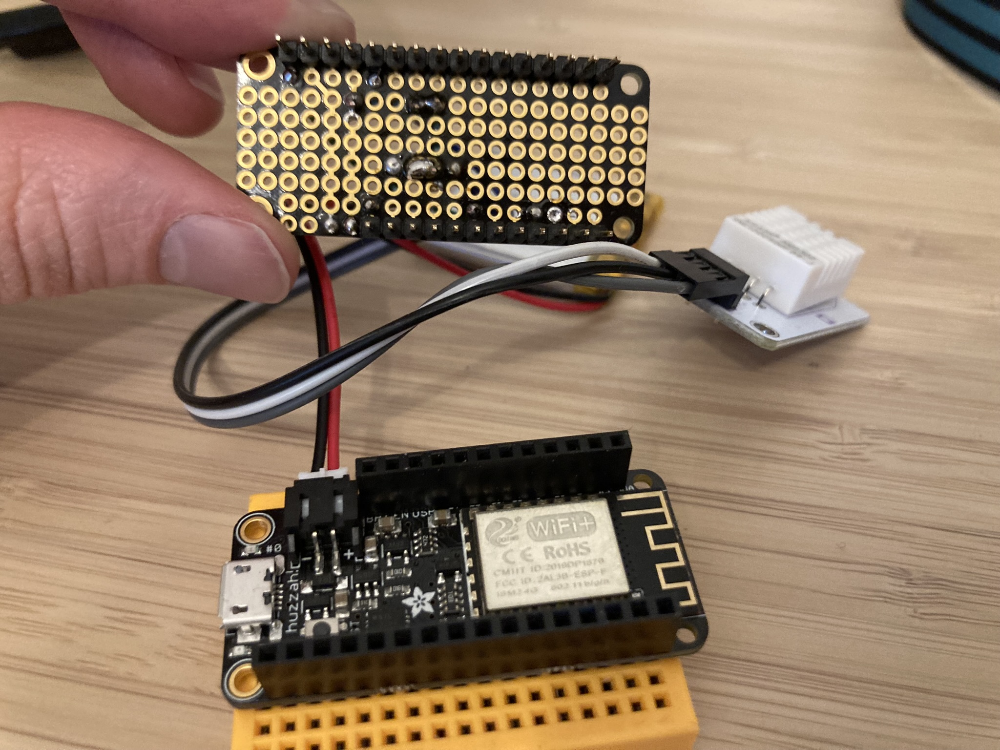
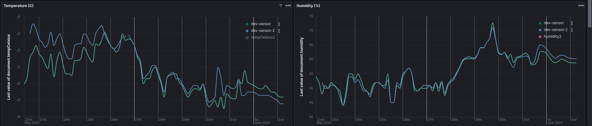

> This article is a work in progress

## Supporting software architecture

The first component needed for this system is a logging system which allows me to

- Receive HTTP calls from the sensors
- Store and display applicative logs of these calls for debugging purpose
- Store and display the metrics gathered by the sensors

To get these features I'm using [my API](https://github.com/statox/api.statox.fr) and an Elasticsearch cluster [that I setup earlier](/posts/2024/04/api_logging_elasticsearch/).

The API has an endpoint dedicated to reporting data from the sensors. The endpoint uses a JSON schema to validate the body of the `POST` requests it receives and only allows a specific list of fields to be sent. When a valid request is received, the data is sent via a JSON message to logstash with a specific message indicating that the log contains sensor data.

When logstash received this message, its pipeline detects the specific message and writes the log to a dedicated data stream meant to contain only environmental metrics. I can then use Kibana to create all the visualizations I need to this metric data.

I cut a few corners to get things working for now, but a few things could be reworked in this system:

- I am currently implementing API key-based authentication to ensure only my sensors can call my API.
- Having my sensors connected to the internet and calling my API directly is not an ideal security situation. Once my system is stable, a future iteration will involve having the sensors call a gateway on their local network, with the gateway responsible for sending the data to my API.
- I probably could leverage the ELK stack's ability to handle metrics and avoid sending logs to logstash. This is a topic I need to dig.

## Breadboard prototyping

I went through several iterations to get a working sensor. The goal was to create a device with the following features:

- Read environmental data from one or several sensors. At a minimum, temperature and humidity, ideally also atmospheric pressure, and maybe as a bonus, luminosity, air quality, precipitation volume, ambient noise level, etc.
- Send this data to a remote server via a Wi-Fi network.
- **Safely** operate on battery power.

For the basis of my devices, I chose to use the [Adafruit Feather HUZZAH ESP8266](https://learn.adafruit.com/adafruit-feather-huzzah-esp8266). I chose it for its ability to connect to a Wi-Fi network without hassle, the several input pins it offers, and its compatibility with the [FeatherWing Proto](https://learn.adafruit.com/featherwing-proto-and-doubler), which allows creating a self-contained device without having to design and print a complete PCB.

### VMA320

I created my first iterations on a breadboard, and the first sensor I tried was a [VMA320](https://www.velleman.eu/products/view/?id=435554), which I had laying around in my toolkit. The VMA320 returns the current temperature on its data pin with an analog output.

```
VMA320

temperature range: -55 °C to 125 °C
accuracy: ± 0.5°C
connection: analog output
```

The analog output of the VMA320 is proportional to the logic voltage we apply to it. Since the ESP8266 has a 3V logic, the output can go up to 3V, but the analog input pin of the ESP8266 can handle only up to 1V. So I needed to create a voltage divider to be able to read the output of the sensor.

This had two major drawbacks:

- Because of the inaccuracies in my resistor values and the code I used to read from the voltage divider, I was not very confident in the data I got from the sensor.
- The ESP8266 only has one analog input pin, which I knew I would need later on to monitor the battery.

With this first version I confirmed that I was able to

- Upload code to the ESP8266
- Interface with its pin
- Debug my code when running on the SoC


<center>
    <i>The early prototype: Breadboard version of ESP8266 reading from a VMA320</i>
</center>


<center>
    <i>The early prototype: Schematics version of ESP8266 reading from a VMA320</i>
</center>

```arduino
#include <math.h>

/*
 * Code for the VMA320 temperature sensor
 * https://www.velleman.eu/products/view/?country=be&lang=fr&id=435554
 */

#define SENSOR_PIN A0 // Input PIN: ADC (The only analogue pin on ESP8266)

// Based on https://stackoverflow.com/a/44932077/4194289
double analogToCelsius(int RawADC) {
    double Temp;
    Temp =log(10000.0/(1024.0/RawADC-1)); // for pull-up configuration
    Temp = 1 / (0.001129148 + (0.000234125 + (0.0000000876741 * Temp * Temp ))* Temp );
    Temp = Temp - 273.15;            // Convert Kelvin to Celcius
    return Temp;
}

double readTempCelsius() {
    int sensorvalue = analogRead(SENSOR_PIN);
    double celsius = analogToCelsius(sensorvalue);

    return celsius;
}
```

<center>
    <i>The code to read from the VMA320 is awkward</i>
</center>

### DHT11 and battery level

My second iteration replaced the VMA320 with a [DHT11](https://www.adafruit.com/product/386) I also had from an earlier attempt at this project. This allowed me to free the ESP8266 analog pin and to benefit from the more accurate sensor.

```
DHT11

temperature range: 0 °C to 50 °C
accuracy: ± 2°C

humidity range: 20% to 80%
accuracy: ± 5%

connection: digital output
sampling rate: 0.5Hz to 1Hz (Depending on the sources)
```


<center>
    <i>Early prototype: Breadboard version of ESP8266 reading from a DHT11</i>
</center>

To read the sensor's data I used [adafruit's DHT library](https://github.com/adafruit/DHT-sensor-library) which allowed me to greatly simplify my code:

```arduino
#define DHTPIN 13      // Pin used to read the DHT sensor
#define DHTTYPE DHT11  // Can be changed for DHT22 sensors

// Initialize DHT sensor for normal 16mhz Arduino
DHT dht(DHTPIN, DHTTYPE);

void initDHT() {
    dht.begin();
}

float* readDHT() {
    // Reading temperature or humidity takes about 250 milliseconds!
    // Sensor readings may also be up to 2 seconds 'old' (its a very slow sensor)
    float h = dht.readHumidity();
    // Read temperature as Celsius
    float t = dht.readTemperature();

    float* result = new float[2];
    result[0] = t;
    result[1] = h;

    // Check if any reads failed
    if (isnan(h) || isnan(t)) {
        Serial.println("Failed to read from DHT sensor!");
    }

    return result;
}
```

With this version I also started using a Li-Po battery to power the system. This is the part that I was most worried about because Li-Po batteries tend to be explode pretty impressively when mishandled and I'm not keen on seeing that happening in my house. Using this type of battery requires a basic understanding of how they work to avoid pushing them into unsafe zones.

The Li-Po voltage is around 4.2V when fully charged. It then decreases to around 3.7V and remains stable at this voltage for a relatively long time. Subsequently, the voltage drops quickly. It is recommended to stop using the battery below 3.3V, and the battery's protection circuitry is designed to shut it down completely at around 2.5V.

To monitor the battery level, I created a voltage divider to scale the 4.2V voltage down to 1V, which I could then read from the ESP8266 analog pin. As shown in the schematic, I could also use my voltmeter to directly measure the battery's output voltage.


<center>
    <i>Voltage divider schematic to read battery level</i>
</center>

After adding some code to convert the analog reading into a percentage of charge and send it to the server, I successfully created my first visualization with a graph showing the temperature, humidity, and battery level.


<center>
    <i>The first Kibana visualization</i>
</center>

At this point the main loop of the arduino code was as follow:

- Read from the sensor
- Send the readings to the server
- Use [`delay()`](https://www.arduino.cc/reference/en/language/functions/time/delay/) to pause the program for 10 minutes
- Repeat.

I decided to let the system run for several hours to observe its performance, and it seemed to work well. I got confused by my battery readings and ended up [asking for help on the adafruit forum](https://forums.adafruit.com/viewtopic.php?p=1016286):

- The battery continued operating at voltages much lower than I had expected.
    - I learned that the shutdown voltage of the battery circuitry is not standardized and varies by manufacturer.
- Despite the low battery voltage, the ESP8266 continued running.
    - I learned that the board is more efficient than I had realized, and its ability to operate at lower voltages is a feature.

Even though my calculations for the battery percentage were slightly inaccurate, the discharge curve of my battery matched exactly what I had expected based on my research into Li-Po batteries. Therefore, both my voltage divider and raw readings were correct!


<center>
    <i>Battery tension dropping</i>
</center>

## From the breadboard to the protoboard

With my initial tests successful, I decided to transition my sensor setup from the breadboard to a more permanent solution that would be easier to move around the house and manipulate. To achieve this, I mounted the Feather on a mini breadboard and utilized the FeatherWing to establish connections to the sensor and implement the voltage divider for the battery.




<center>
    <i>Moving the project to a protoboard</i>
</center>

### DHT22

At this point, I replaced the DHT11 sensor with a [DHT22 module](https://whadda.com/product/cm2302-dht22-temperature-humidity-sensor-module-wpse345/). The DHT22 is essentially an upgraded version of the DHT11, and the module includes a convenient pull-up resistor.

```
DHT22

temperature range: -40 °C to 80 °C
accuracy: ± 0.5°C

humidity range: 0% to 100%
accuracy: ± 2-5%

connection: digital output
sampling rate: 0.5Hz
```

Adafruit has an interesting [comparison page](https://learn.adafruit.com/dht). Switching to the DHT22 was quite convenient: the DHT library functions the same way for both sensors, so it was simply a matter of connecting it to the same pins and changing the `DHTTYPE` constant in my code.

I also created a second device identical to the first one and let them run for several days to compare their readings. The following graph shows these readings:

- Between the 22nd and the 26th, the sensors were placed at two opposite corners of the same room.
- Between the 26th and the 30th, they were placed right next to each other.
- After the 30th, they were placed in two different rooms in a fairly small apartment.



<center>
    <i>Similar curves for two different sensors</i>
</center>

I am pleased with the results. Although my methodology is not the most scientific, I am fairly confident to say that:

- Since both curves generally follow the same pattern, both sensors have similar reaction times and sensitivity.
- The minimal differences observed when the sensors are next to each other suggest they are calibrated similarly.

With these results, I'm not certain about the absolute accuracy of the readings (e.g., whether the sensors accurately reflect the current temperature: when they indicate 24°C is it really 24°C or 22°C or 26°C?), but they should be meaningful and sufficient for my goal of understanding how temperature evolves in my apartment.

### BME280

Another metric I wanted to track in my system is atmospheric pressure. For this, I used [a BME280](https://whadda.com/product/bme280-temperature-humidity-and-pressure-sensor-wpse335/) sensor, which I connected to one of my devices that already had a DHT22. This allowed me to have both sensors in the same location and use a single ESP8266 to read from them.

I opted to use the BME280 in I2C connection mode, requiring only 4 pins to connect to the board: 2 for power supply and 2 for data reading. The I2C connection also means that the sampling rate is essentially as fast as I want now (not that it matters since I am still polling the sensors every 10 minutes).

```
BME280

temperature range: -40 °C to 85 °C
accuracy: ± 0.5°C

humidity range: 0% to 100%
accuracy: ± 3%

pressure range: 300hPa to 1100 hPa
accuracy: ± 1hPa

connection: I2C (also support SPI)
sampling rate: -
```


<center>
    <i>Protoboard with BME280</i>
</center>

I then compared the readings of the BME280 with those of the two DHT22 sensors to check for calibration issues. The raw values show the BME280 as the pink curve, while the blue and green curves represent the two DHT22 sensors.


<center>
    <i>The BME280 is not calibrated the same way as the DHT22 (left: temperatures, right: humidity)</i>
</center>

For the temperature, the BME280 closely follows the trend of the other two sensors but with an offset of about 0.6°C. Regarding humidity, the situation is more complex: there appears to be both an offset and a scaling issue. After adjusting the humidity curve using the formula `20 + (0.7 * last_value(document.humidity2, kql='"document.humidity2": *'))`, I obtained the following results:


<center>
    <i>However the readings can be transformed to better fit the DHT22 readings (left: temperatures, right: humidity)</i>
</center>

Good enough for me! Again, I'm unsure about the absolute calibration of the sensors, but they are consistent with each other, so my measurements should be reliable.

I also really liked [this article](https://www.kandrsmith.org/RJS/Misc/Hygrometers/absolutetemperature.html) by Robert Smith about his process for calibrating thermometers. At some point, I intend to try a similar ice bath experiment.

## Adding an enclosure

Now that I'm confident my sensors work well, I want to enclose them properly. I have two different needs: enclosures for the indoor sensors to tidy up cables and protect them from daily life, and enclosures for the outdoor sensors that need to be weatherproof.

### Indoor enclosure

For my indoor enclosure I am considering two options:

Mastering [Mecabricks](https://www.mecabricks.com/en/workshop) to design a Lego enclosure and then using the Lego [Pick a Brick](https://www.lego.com/fr-fr/pick-and-build/pick-a-brick) to acquire the necessary bricks. However, this option is on hold until I improve my skills with the online tool.

Using a colleague's 3D printer to print a suitable enclosure. I have started to gather quotes for the project, but this is also on hold for now.


<center>
    <i>Behold my incredible technical drawing skills!</i>
</center>

### Outdoor enclosure

This enclosure is more complex because it needs to protect the board and the battery from significant humidity changes while allowing the sensor to be exposed to the environment for accurate readings. I have no experience with this type of project, but I intuition tells me that exposing electronic components and sensitive batteries outdoors requires some caution.

Therefore, I began by researching and educating myself:

- [Humidity evolution (breathing effect) in enclosures with electronics](https://vbn.aau.dk/ws/portalfiles/portal/221557312/2015IMAPS_breathing_effect.pdf)
- [Modeling and Simulation of Humidity Inside Sealed Boxes](https://www.researchgate.net/profile/Zheng-Guilin/publication/232616036_Modeling_and_Simulation_of_Humidity_Inside_Sealed_Boxes/links/540d5b550cf2f2b29a383bf9/Modeling-and-Simulation-of-Humidity-Inside-Sealed-Boxes.pdf)
- [A Guide to Engineering Moisture & Pressure Protection for Sealed Enclosures](https://www.agmcontainer.com/blog/how-to/engineering-moisture-pressure-protection-guide/)
- [forum discussion about sensors protection](https://forum.mysensors.org/topic/1560/how-to-protect-your-outdoor-sensor)

These papers are super interesting but I ended up winging it: I bought a small plastic enclosure similar [to this one](https://www.adafruit.com/product/903) with a toric joint for waterproofing and a weatherproof cable gland. The idea is to have the sensor outside of the box while the ESP8266 and its battery remain safe in a waterprood box.


To test this enclosure I used my two DHT22 sensors: One in the box and one not in the box:


<center>
    <i>Metrics in the weather-proof enclosure</i>
</center>

I found that the box doesn't prevent temperature changes (as expected), but it does maintain the humidity level at what it was when sealed. This should be sufficient for my upcoming initial tests of the outdoor sensor.
