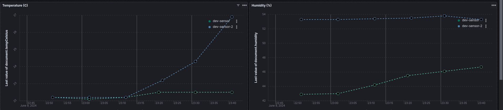

> _This post is a copy-past of a personnal message sent to a relative to talk about my project. A more complete and technical version is available [here](/posts/2024/06/environment_sensors/)._

L'idée est de mettre en place des capteurs qui me remontent régulièrement la température et l'humidité des différentes pièces de l'appartement et de l'extérieur de l'appartement, de corréler ces données aux données de stations météo France autour de chez nous et de visualiser l'évolution de ces données au cours du temps. Le but est d'une part de mieux comprendre comment garder l'appartement le plus frais possible pendant les canicules, mais surtout de m'amuser avec de l'électronique et en apprendre plus sur la météorologie!

L'expérience débute avec la réalisation de capteurs environnementaux "maison". D'abord la version la plus simple possible qui sera équipée de l'équivalent d'un [arduino avec une puce wifi intégrée](https://learn.adafruit.com/adafruit-feather-huzzah-esp8266) connecté à un [capteur de température et d'humidité](https://learn.adafruit.com/dht). Un œil avisé remarquera trois résistances branchées entre le positif et la masse avec un fil qui part de l'une d'entre elle pour aller jusqu'au circuit, le lecteur électronicien identifiera peut être un pont diviseur de tension: le système est alimenté par une petite batterie LiPo (à gauche de la photo), ces batteries ayant une fâcheuse tendance à exploser quand leur charge atteint un niveau trop bas il est nécessaire de surveiller le niveau de charge. Mais les entrées analogiques du circuit ne supportant une tension maximale que de 1V et la batterie délivrant entre 4.2V et 3.3V dans sa zone de sécurité, on a besoin d'un pont diviseur pour ramener la tension de la batterie à une tension lisible par le circuit.

    <i>The early prototype: Breadboard version of ESP8266 reading from a DHT11</i>

Une fois ce premier montage fonctionnant on se félicite de ne pas avoir fait exploser la batterie et on essaie d'exploiter la donnée du capteur: Pour ce faire le circuit va relever la température et l'humidité toutes les 10 minutes et utiliser sa puce wifi pour appeler un serveur. C'est un serveur sur lequel le créateur travaille depuis plusieurs mois et dont la dernière fonctionnalité implémentée par ses soins permet de recevoir un appel HTTP contenant des informations et de les enregistrer dans une base de donnée spécialement conçue pour contenir des données "temporelles" (qui évoluent avec le temps).

On passera au lecteur les détails techniques et on retiendra que l'on commence a obtenir des graphiques de ce genre représentant l'évolution de la température et de l'humidité et de la charge de la batterie au cours du temps. Le lecteur attentif remarquera que les données ne semblent pas significatives pour l'instant: Le capteur n'a pas fonctionné en continu pendant l'expérience, les manipulations ont faussé les valeurs de température et la charge de la batterie est notée au delà de 100%. Le créateur y verra néanmoins un début prometteur!

    <i>The first Kibana visualization</i>

Les étapes suivantes consisteront en deux avancées majeures: On passe du format "planche d'expérimentation" (breadboard) au format "planche de prototypage" (protoboard) qui s'enfiche directement sur les connections du circuit pour réduire l'encombrement du capteur. On remplacera également le capteur DHT11 par un capteur DHT22, qui a l'avantage d'être plus stable dans ses relevés, d'avoir une précision de température de ±0.5°C contre ±2°C pour l'ancien capteur DHT11, un plus large champ de relevés d'humidité (0-100% contre 20-80%) contre l'inconvénient de ne pouvoir donner des résultats significatifs que toutes les 2 secondes (contre une fréquence d’échantillonnage minimale de toutes les 1 secondes pour le DHT11) ce qui n'est pas un problème en soit vu que le système est conçu pour faire des relevés toutes les 10 minutes.

    <i>Moving the project to a protoboard</i>

On aura réalisé 2 capteurs similaires pour commencer a comparer la précision des capteurs industriels achetés et on se félicitera de voir que sur la période du 25 au 30 mai où les capteurs sont resté placés l'un à coté de l'autre les valeurs sont très similaires!

    <i>Similar curves for two different sensors</i>

À ce moment on commence à se poser la question du conditionnement des capteurs: Comment créer des boites qui permettent à la fois de protéger les capteurs des aléas d'un environnement ménager tout en leur permettant d'assurer au mieux leur fonction de relevés? Plusieurs pistes seront envisagées d'une part un collègue propose de mettre à disposition son imprimante 3d afin de créer des boites parfaitement adaptées au système, d'autre part le créateur envisage la conception de boites faites de pièces de Lego. Pour ce faire l'auteur fera ressortir ses anciens cours de dessin industriel et tentera de relever au mieux les cotes du projet. Néanmoins la partie de création de boites est pour l'instant à l’arrêt du fait d'un manque de temps pour relancer l'imprimante 3d et d'un créateur qui a remis à plus tard l'idée de maîtriser [l'outil de conception d'assemblage de Lego](https://www.mecabricks.com/en/workshop) en 3d pour concevoir la boite uniquement depuis un ordinateur et sans pièces Lego à disposition.

    <i>Handmade sensor quotes</i>

À défaut de boite artisanales adaptées à l'environnement intérieur le créateur se lance ensuite dans la réalisation d'une boite "weather-proof" qui pourra accueillir le capteur en milieu extérieur, on s'appuiera alors sur un boîtier issu du commerce et équipé d'un joint torique dans lequel on réalisera une ouverture afin de faire passer un passe cable étanche. Le but étant d'assurer au circuit et à sa batterie un environnement à l'humidité stable tout en permettant au capteur d'être placé en extérieur afin de mesure au mieux son environnement:

    <i>Sensor in a weather-proof enclosure</i>

Ce système sera testé via la méthode dite "de la bonne grosse douche bien chaude": On placera le capteur dans son boîtier étanche ("dev-sensor-2" courbe bleue) dans une salle de bain pendant la douche du créateur pendant qu'un second capteur non protégé ("dev-sensor" courbe verte) sera placé derrière la porte de la-dite salle de bain . Le lecteur pourra observer que si le boîtier étanche ne protège pas le circuit des changements de températeurs (courbe de gauche) l'humidité à l'intérieur du boîtier, elle, reste constante quand l'humidité à l'extérieur de la salle de bain augmente significativement: Réussite notre boiter étanche est bien étanche!

    <i>Metrics in the weather-proof enclosure</i>

La suite consiste désormais à intégrer [un nouveau type de capteur](https://whadda.com/product/bme280-temperature-humidity-and-pressure-sensor-wpse335/) afin qu'une fois en extérieur les relevés puissent intégrer la pression atmosphérique, composante cruciale de la prévision météo. L'auteur profitera de l'occasion pour se documenter sur les systèmes météorologiques d'anticyclone, de dépression, de fonts chauds, froids et composites, des différents facteurs ayant une influence sur la pression atmosphérique, ainsi que sur les recommendations d'installations de stations météo amateur.

(En haut à gauche le nouveau capteur BME280 combinant pression, température et humidité -meme si 6 connections sont accessibles seulement 4 sont vraiment utilisées dans notre système-. L'ancien capteur DHT22 reste également connecté pour comparer les relevés)

    <i>Protoboard with BME280</i>

En plus de ce nouveau capteur l'auteur aura pris soin d'incorporer à ses tableaux de mesures les informations fournies par les stations MétéoFrance installées dans Paris. En effet MétéoFrance met à la disposition du public un service permettant d'interroger ses bases de données en temps réel et de recevoir les mises à jour horaires de ses différentes stations. Toutes les stations ne renvoient pas les mêmes informations par exemple seulement Longchamp et Montsouris fournissent des relevés d'humidité:

    <i>Meteo-France temperature and humidity</i>

Sur le graph de gauche le lecteur avisé s'interrogera sûrement sur la station renvoyant une température constamment inférieure a toutes les autres: cette station est en fait située au sommet les 330 mètres de la Tour Eiffel, ce qui explique une température en moyenne 3 degrés inférieurs à l'ensemble des autres stations qui se situent en moyenne a 1m20 du sol.

On récupère également les niveaux de précipitations de certaines stations (On notera que ces données semblent toutes arrondies à l'entier le plus proche, une interrogation en cours pour l'auteur, plus de détails dans un prochain épisode)

    <i>Meteo-France precipitations</i>

Enfin on récupère la pression atmosphérique renvoyée uniquement par la stations de Montsouris (en jaune) et en la compare à la pression relevée par notre capteur maison. Le lecteur pourra s’enthousiasmer du niveau de précision du capteur qui suit de très près les variations de la station:

    <i>Atmospheric pressure</i>

Mais si les variations sont suivies de près on notera que les valeurs remontées ont un écart constant de 4hPa ce qui nous amène à la question cruciale du moment: Comment les capteurs sont-ils calibrés et comment mesurer compenser leur défaut s'il existe?

Prenons par exemple les mesures d'humidité:

    <i>Humidity with error</i>

Nous avons en tout 3 capteurs: 2 DHT22 (courbe verte et courbe bleue) et 1 BME280 (courbe rose). À première vue les allures sont similaires mais on remarque que le BME280 à l'air d'avoir une erreur d'environ 4.8%, on peut donc tracer la courbe 4.8% plus haut mais on se rend compte alors que le capteur n'a peut être pas qu'un défaut de décalage mais aussi un défaut d'échelle: Pourquoi les pics roses sont-ils plus hauts que les pics verts et bleus?

    <i>Humidity correction hypothesis</i>

Les resources en ligne décrivent des protocoles expérimentaux pour tenter de quantifier ce genres de décalages. Une méthode possible consiste à remplir une bouteille Thermos de glace pilée réalisée a partir d'eau déminéralisée pour atteindre une température exacte de zéro degrés et à partir de cette température connue observer les relevés des capteurs et en déduire le biais. Ce genre d'expériences pourraient bien occuper les prochains weekends du créateur, qui ne manquera pas de tenir son lecteur informé des évolutions du projet!
