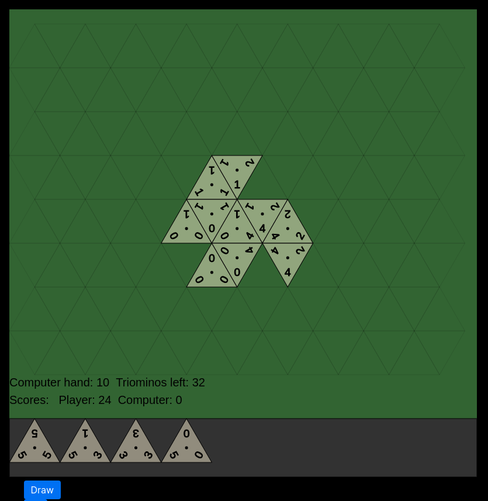

### Board games are fun!

During the winter holidays I played some games of Triomino and Reversi, which I hadn't done in an eternity. This reminded me that the first programs I enjoyed coding were some board game and it gave me the motivation to get back on some side projects.

So once again I cloned my boilerplate git repo with an html page and the p5.js library imported and started coding.

Even though I didn't finished any of these projects they were still fun to work on and worth a short blogpost, for the posterity.

### Triomaster

As the name of the project suggest I was aiming for an IA mastering the Triomino game... I ended up with an IA playing the Triomino game.

When I started thinking about this project I had in mind a [great article on redblobgame](http://www-cs-students.stanford.edu/~amitp/game-programming/grids/) about different kind of grids and how to implement them I had read several months ago and thought it would be useful. But being impatient to start coding I went straight in and didn't read it again, probably making some mistakes which I could have avoided.


<center>
    <i>Another obvious proof of my UX/UI designer genius</i>
</center>

#### Grid system

I ended up with a two dimensional array containing consecutive `Cell` objects. These objects have a `pointsDown` property set at the creation of the grid and used to determine how the tile is displayed (pointing up or down). When a tile is placed on it, the object also have a reference to a `Triomino` object holding the actual values of the tile and which is responsible for checking which other triominos are allowed to connect or not. With a bit of math (and a lot of poking around to find the correct formula) I was able to show triangles adjacent one to another pointing alternatively up and down.

```javascript
this.show = () => {
    push();
    stroke('rgba(0, 0, 0, 0.1)');
    strokeWeight(1);
    noFill();

    // Show the user which cell is clicked
    if (this.selected) {
        fill('rgba(50, 200, 50, 0.3)');
    }

    // Move to the right position and rotate to point up
    translate(this.pos.x, this.pos.y);
    // If needed rotate again to point down and translate so that we are aligned with those pointing up
    if (this.pointsDown) {
        translate(0, -this.r * Math.cos(PI / 3));
        rotate(PI);
    }
    rotate(-PI / 2);

    // Draw the triangle shape
    beginShape();
    vertex(this.r, 0);
    vertex(this.r * Math.cos((2 * PI) / 3), this.r * Math.sin((2 * PI) / 3));
    vertex(this.r * Math.cos((4 * PI) / 3), this.r * Math.sin((4 * PI) / 3));
    endShape(CLOSE);
    pop();

    if (this.triomino) {
        this.triomino.show();
    }
};
```

Things got messy when I finished displaying the triangles and started thinking about how to click on them (to select the triomino to play and where to place it). I didn't felt like doing the math to determine when the mouse is in a particular triangle, so I thought I would be smart and lazy using the [p5play](https://molleindustria.github.io/p5.play/) library. It provides the ability to create some sprites and to attach an event when the sprite is clicked, offloading the burden of calculating mouse-to-sprite collisions. I choose to go quick and dirty, adding a `Sprite` object to each `Cell` and `Triomino` objects with nothing in the `draw()` function of the `Sprite` because I already had a nice `draw()` function in the `Cell`. Of course after several iterations when the project got more complex it just added more complexity and was probably not the smartest choice.

One of the main issue was to keep the `Sprite` position synced with its parent object position (mainly because I handled the `Triomino` moves terribly). After some tweaks it ended up working.


#### AI

At first I wanted to go with a clever AI which would use some kind of A* algorithm to find the best possible move to do.  However my first AI version was much more simple: Looking for all the possible moves and placing the triomino with the highest score.

To have a working AI I needed to implement the [complete set of scoring rules](https://www.pressmantoy.com/wp-content/uploads/2018/01/Tri-Ominos.pdf), but I only implemented the basic rule of "when the player places a tile her score is incremented by the sum of the digits on the tile" and the bonus points at the beginning of the game. I didn't implement bonuses when completing some shapes.  implemented the bonus points when a shape is completed

So given my incomplete set of rules I played a few game against my basic AI and I realized that it is still pretty good, actually as good as a human who would play the game for the first time without thinking of the strategy but never missing a possible spot.

After these few games I realized that Triomino quickly gets boring and that luck is a big factor anyway so I decided to switch to my next project.

#### Online demo

I'm still happy with the result of this project: One can play a complete game against the computer, the scores are keept track of an a winner is declared before the game starts again.

There are still a tons of features which I would want to add, especially the ability to scroll over the board to avoid being blocked by its small dimension but the way I handled sprites makes it pretty hard to do and that would probably require a complete refactoring.

A demo is hosted on github pages and available [here](https://statox.github.io/triomaster/) and the code is [on
Github](https://github.com/statox/triomaster).
