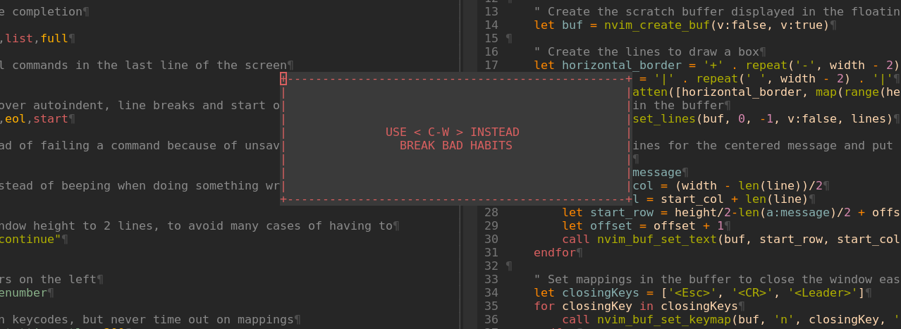
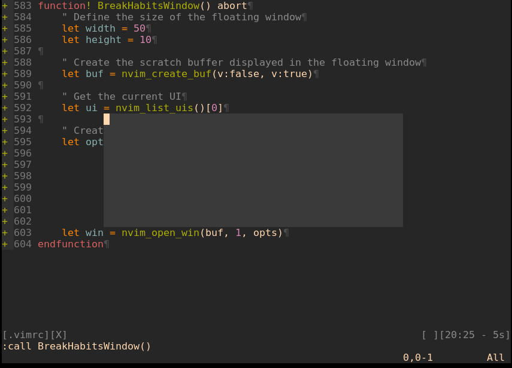
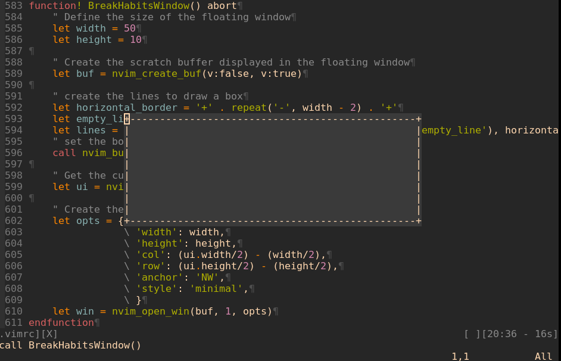
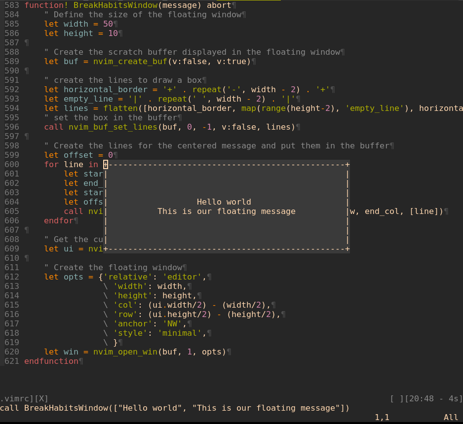
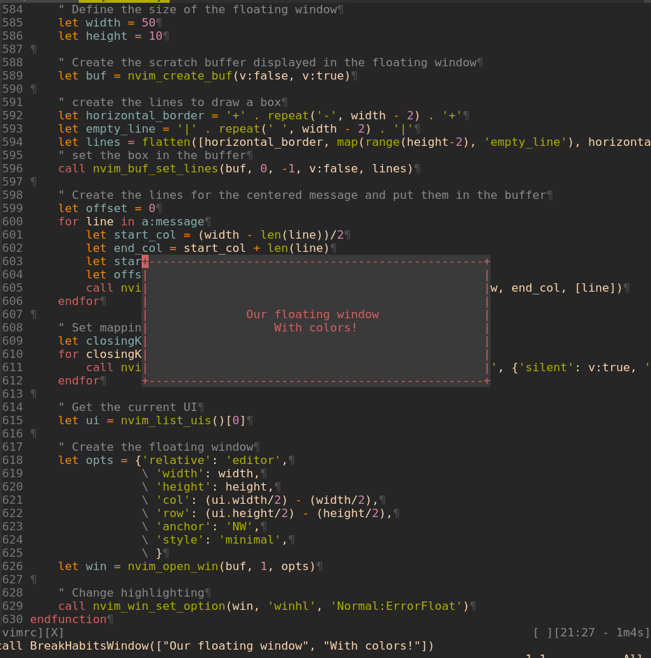

In 2016 I added to my `.vimrc` a mapping to get easier access to window commands in normal mode. I was pretty happy with it in my local setup but it broke my workflow when I edited files on remote servers. Over time this got pestering enough for me to take action and decide to solve the issue. I thought it was a good opportunity to experiment with Neovim [floating windows](https://neovim.io/doc/user/api.html#api-floatwin).

In this article I'll show how I used some of the Neovim features to create a quick way to get rid of my bad habits. If you never used the floating window it should be an introduction to get started with this feature and give you some inspiration to use it for your own needs.

### The problem

The problematic mapping I added to my `.vimrc` is the following:

```vim
" Use s instead of <C-w> to handle windows
nnoremap s <C-w>
```

This remaps `s` in normal mode to `<C-w>` which is the default mapping to access window commands. For example instead of using <kbd>ctrl+w</kbd><kbd>v</kbd> and <kbd>ctrl+w</kbd><kbd>s</kbd> to create splits or <kbd>ctrl+w</kbd><kbd>o</kbd> to focus the current split I can use respectively <kbd>s</kbd><kbd>v</kbd>, <kbd>s</kbd><kbd>s</kbd> and <kbd>s</kbd><kbd>o</kbd> (See [`:h CTRL-W`](http://vimhelp.appspot.com/index.txt.html#CTRL-W) for the complete list of window commands if you are not familiar with them). This feels more comfortable to use a single key rather than pressing a key chord.

The issue with this mapping is that `s` is a built-in Vim command, [`:h s`](http://vimhelp.appspot.com/change.txt.html#s) says:

    ["x]s   Delete [count] characters [into register x] and start
            insert (s stands for Substitute).  Synonym for "cl"
            (not linewise).

I've never found a use case where this is actually helpful (as the doc says `cl` does almost the same thing) so remapping it didn't really affect my productivity. However when I edit files on remote severs where I haven't uploaded my config my muscle memory makes me press <kbd>s</kbd> and I end up editing the current buffer instead of manipulating my windows which is irritating.

When I decided to get rid of this nasty habit I removed the mapping from my `.vimrc` but I also needed something to annoy me out of using it. An easy solution would have been to remap the key to [`<Nop>`](https://neovim.io/doc/user/intro.html#%3cNop%3e) so that it does nothing but then the command silently fails and I end up executing the second part of the command (`v`, `s`, `o`...) which is not ideal for my workflow. That's when the floating window comes useful. I wanted to have a very visible warning saying that I used a command I shouldn't have and that I should try again with the right command.

### Specifying the solution

Here is the solution I came up with:



This floating window is shown when I press a command I want to avoid. There are a few features I wanted to have in this solution:

- The window is spawned in the middle of Neovim UI so that I can't miss it;
- The borders of the window are delimited with ascii characters to make it more visible;
- It should be easy to close the window both with regular commands (like `:close`) and with specific keys like <kbd>Escape</kbd>, <kbd>Enter</kbd> or <kbd>Space</kbd> (which is my leader key);
- I should have a convenient command to "disable" several normal mode commands with this window;
- The message shown in the window should be multi-lines, centered and configurable depending on the disabled command.

### Implementing the solution

#### Spawning a floating window

The first step get to this solution is to create a function spawning a new floating window:

```vim
function! BreakHabitsWindow() abort
    " Define the size of the floating window
    let width = 50
    let height = 10

    " Create the scratch buffer displayed in the floating window
    let buf = nvim_create_buf(v:false, v:true)

    " Get the current UI
    let ui = nvim_list_uis()[0]

    " Create the floating window
    let opts = {'relative': 'editor',
                \ 'width': width,
                \ 'height': height,
                \ 'col': (ui.width/2) - (width/2),
                \ 'row': (ui.height/2) - (height/2),
                \ 'anchor': 'NW',
                \ 'style': 'minimal',
                \ }
    let win = nvim_open_win(buf, 1, opts)
endfunction
```

We begin by creating the buffer which will be shown in the floating window. Neovim provides the [`nvim_create_buf()`](https://neovim.io/doc/user/api.html#nvim_create_buf%28%29) function to create an unlisted buffer and return its reference.

We then need to call [`nvim_list_uis()`](https://neovim.io/doc/user/api.html#nvim_list_uis%28%29) to get the currently attached UIs. In my case I only have one UI (the Neovim instance open in my terminal) so I can directly use the first item of the returned list, there are probably some cases where one would want to be more thoughtful about the way to get this info but for now I want to keep things simple. We will then use `ui.width` and `ui.height` to get its dimensions.

Finally we can use `nvim_open_win()` to open the floating window. The function takes three arguments:

- The handle of the buffer we previously created and which will be used in the window.
- A boolean specifying if the window should be focused immediately after its creation. Here we set it to `v:true` because we want the window to be focused to close it easily.
- A map defining the window configuration. [The doc](https://neovim.io/doc/user/api.html#nvim_open_win%28%29) describes all the available options. Here we especially make use of `width` and `height` to define the size of the window and `anchor`, `col` and `row` to define where on the screen we will place it.

Calling this function with `:call BreakHabitsWindow()` will spawn a simple empty floating window:



#### Showing the window borders

My second requirement is to have a box drawn in the buffer to show the borders of the window. There are a lot of different ways to achieve this but Neovim provides a convenient [`nvim_buf_set_lines()`](https://neovim.io/doc/user/api.html#nvim_buf_set_lines%28%29) function to set the content of a buffer.

We start by creating the strings to use as the first and last lines and as the ones in between thanks to [`repeat()`](http://vimhelp.appspot.com/eval.txt.html#repeat%28%29) and put them in a list:

```vim
" create the lines to draw a box
let horizontal_border = '+' . repeat('-', width - 2) . '+'
let empty_line = '|' . repeat(' ', width - 2) . '|'
let lines = flatten([horizontal_border, map(range(height-2), 'empty_line'), horizontal_border])
```

We can then use this list with `nvim_buf_set_lines()`:

```vim
" set the box in the buffer
call nvim_buf_set_lines(buf, 0, -1, v:false, lines)
```

Adding that to our `BreakHabitsWindow()` function we get the following result:



#### Adding a message in the window

Next step is to show a message in the window. To do that we will add a parameter to the `BreakHabitsWindow()`. As we want multi-lines messages this parameter will be a list of strings with each item being a line.

```vim
" Add a parameter which can then be accessed with a:message
function! BreakHabitsWindow(message) abort
```

To add this message in the window we will use [`nvim_buf_set_text()`](https://neovim.io/doc/user/api.html#nvim_buf_set_text%28%29), as the doc says this function is preferred to `nvim_buf_set_lines()` when only modifying parts of a line.

The function takes as parameters a buffer reference, the position of the text to replace (`start_row`, `start_col`, `end_row` and `end_col`) as well as the text to use. So we loop over each lines of the message, compute the position and put it in the buffer:

```vim
" Create the lines for the centered message and put them in the buffer
let offset = 0
for line in a:message
    let start_col = (width - len(line))/2
    let end_col = start_col + len(line)
    let current_row = height/2-len(a:message)/2 + offset
    let offset = offset + 1
    call nvim_buf_set_text(buf, current_row, start_col, current_row, end_col, [line])
endfor
```

We can now call the function with the right parameter `:call BreakHabitsWindow(["Hello world", "This is our floating message"])` and here we have a message in the window:



#### Closing the window

Once the window is spawned I want to be able to close it easily. Using [`:close`](https://neovim.io/doc/user/windows.html#%3aclose) is an option but I want something faster and it is the opportunity to explore [`nvim_buf_set_keymap()`](https://neovim.io/doc/user/api.html#nvim_buf_set_keymap%28%29). This function allows to set buffer-local mappings. Let's define our closing keys and make them call `:close`:

```vim
" Set mappings in the buffer to close the window easily
let closingKeys = ['<Esc>', '<CR>', '<Leader>']
for closingKey in closingKeys
    call nvim_buf_set_keymap(buf, 'n', closingKey, ':close<CR>', {'silent': v:true, 'nowait': v:true, 'noremap': v:true})
endfor
```

The parameters are as follow:

- The buffer handle which we already used in the `nvim_open_win()`;
- The mode of the mapping, here we use `n` for normal mode mappings (this is the equivalent of using [`nmap`](http://vimhelp.appspot.com/map.txt.html#%3Anmap));
- The `closingKey` variable holds the left hand side of the mapping;
- The 4th parameter is the right hand side of the mapping;
- And finally we give the mapping options in a map:
  - `silent` to avoid showing the command used,
  - `nowait` to avoid waiting for follow up keys in the mapping
  - and `noremap` to create a non recursive mapping.
  If you are not familiar with these options see [`:h :map-arguments`](https://neovim.io/doc/user/map.html#%3amap-arguments).

With this added to `BreakHabitsWindow()` we can now close the window quickly with our defined keys.

#### Adding some color

We can finally add a last touch to improve our UI, using [`nvim_win_set_option()`](https://neovim.io/doc/user/api.html#nvim_win_set_option%28%29) we can define a different highlighting group for the `Normal` highlighting group to change how the text is displayed. I went with `ErrorFloat` because I liked how it looks but it is possible that this highlighting group is not defined on your setup. You can use [`:highlight`](https://neovim.io/doc/user/syntax.html#%3ahighlight) to list the groups available to you, and check [`:h 'winhl'`](https://neovim.io/doc/user/options.html#%27winhl%27) for more details about highlighting:

```vim
" Change highlighting
call nvim_win_set_option(win, 'winhl', 'Normal:ErrorFloat')
```

And here we are:



#### Creating the mappings

Now that we have a function which spawns the window as we want it the last thing to do is to remap the commands triggering our function. I wanted an easy way to create several mappings with different messages. We can do that with a simple function:

```vim
function! breakhabits#createmappings(keys, message) abort
    for key in a:keys
        call nvim_set_keymap('n', key, ':call BreakHabitsWindow(' . string(a:message). ')<CR>', {'silent': v:true, 'nowait': v:true, 'noremap': v:true})
    endfor
endfunction
```

This makes use of the [`:h nvim_set_keymap()`](https://neovim.io/doc/user/api.html#nvim_set_keymap%28%29) which works like `nvim_buf_set_keymap()` but to create global mappings rather than buffer-local ones.

_There is one caveat with this method: As the `message` list is stringified, there might be some escaping issues (for example using `"<C-w>"` in one of the string breaks the function). There is probably a workaround for that, maybe using [`:h funcref()`](https://neovim.io/doc/user/eval.html#funcref%28%29) but I still have to work on that._

Let's use the [`autoload`](https://neovim.io/doc/user/eval.html#autoload) feature by moving the code to `~/.vim/autoload/breakhabits.vim` and then we can call it from our `.vimrc` like this:

```vim
let windowHabitsKeys = ["s=", "sv", "ss", "so", "sw", "sh", "sj", "sk", "sl", "s<S-h>", "s<S-j>", "s<S-k>", "s<S-l>", "s<", "s>", "sc"]
let windowHabitsMessage = ["USE < C-W > INSTEAD", "BREAK BAD HABITS"]
call breakhabits#createmappings(windowHabitsKeys, windowHabitsMessage)
```

And here we have a finished solution. So far I have been pretty contented with how it works and I'm already fixing my muscle memory, which was my goal! Here is the complete code:

```vim
function! breakhabits#createmappings(keys, message) abort
    for key in a:keys
        call nvim_set_keymap('n', key, ':call BreakHabitsWindow(' . string(a:message). ')<CR>', {'silent': v:true, 'nowait': v:true, 'noremap': v:true})
    endfor
endfunction

function! BreakHabitsWindow(message) abort
    " Define the size of the floating window
    let width = 50
    let height = 10

    " Create the scratch buffer displayed in the floating window
    let buf = nvim_create_buf(v:false, v:true)

    " create the lines to draw a box
    let horizontal_border = '+' . repeat('-', width - 2) . '+'
    let empty_line = '|' . repeat(' ', width - 2) . '|'
    let lines = flatten([horizontal_border, map(range(height-2), 'empty_line'), horizontal_border])
    " set the box in the buffer
    call nvim_buf_set_lines(buf, 0, -1, v:false, lines)

    " Create the lines for the centered message and put them in the buffer
    let offset = 0
    for line in a:message
        let start_col = (width - len(line))/2
        let end_col = start_col + len(line)
        let current_row = height/2-len(a:message)/2 + offset
        let offset = offset + 1
        call nvim_buf_set_text(buf, current_row, start_col, current_row, end_col, [line])
    endfor

    " Set mappings in the buffer to close the window easily
    let closingKeys = ['<Esc>', '<CR>', '<Leader>']
    for closingKey in closingKeys
        call nvim_buf_set_keymap(buf, 'n', closingKey, ':close<CR>', {'silent': v:true, 'nowait': v:true, 'noremap': v:true})
    endfor

    " Create the floating window
    let ui = nvim_list_uis()[0]
    let opts = {'relative': 'editor',
                \ 'width': width,
                \ 'height': height,
                \ 'col': (ui.width/2) - (width/2),
                \ 'row': (ui.height/2) - (height/2),
                \ 'anchor': 'NW',
                \ 'style': 'minimal',
                \ }
    let win = nvim_open_win(buf, 1, opts)

    " Change highlighting
    call nvim_win_set_option(win, 'winhl', 'Normal:ErrorFloat')
endfunction
```

### What about creating a plugin?

I thought about turning that into a plugin available on github but I decided not to go with it for two reasons:

Firstly this is my first time messing with these Neovim features and I'm not entirely sure that I followed every best practices with them. I don't feel like maintaining a public plugin with this code.

Secondly -and this is more important- I think that this kind of feature is pretty sensitive. I have seen countless new vim users following ill-advised plugins like [vim-hardtime](https://github.com/takac/vim-hardtime) or _worse_ [vim-hardmode](https://github.com/wikitopian/hardmode). More often than not people using them don't understand the larger picture of their issue and these plugins get in their way instead of helping them improving their workflow. I don't want to create another instance of this kind of plugin.

### Make it yours!

I hope that this article was useful for you if you never used the floating window. There are already some plugins making use of this feature like [coc](https://www.reddit.com/r/neovim/comments/b1pctc/float_window_support_with_cocnvim/) or [fzf](https://github.com/junegunn/fzf.vim/issues/664) but I'm sure there are other more lightweight usages you can add to your config: Don't hesitate to share them with me either [on Reddit](https://www.reddit.com/r/neovim/comments/m0hyig/using_neovim_floating_window_to_break_bad_habits/) or in [the comments](https://github.com/statox/blog-comments/issues/23)!
