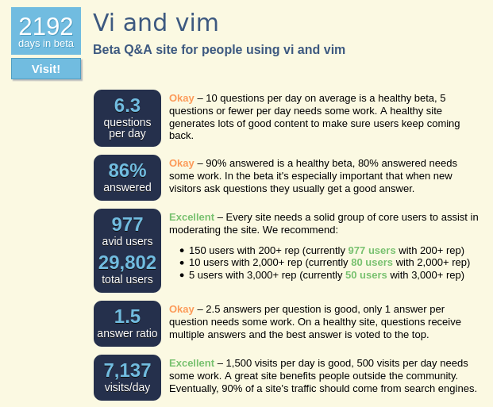
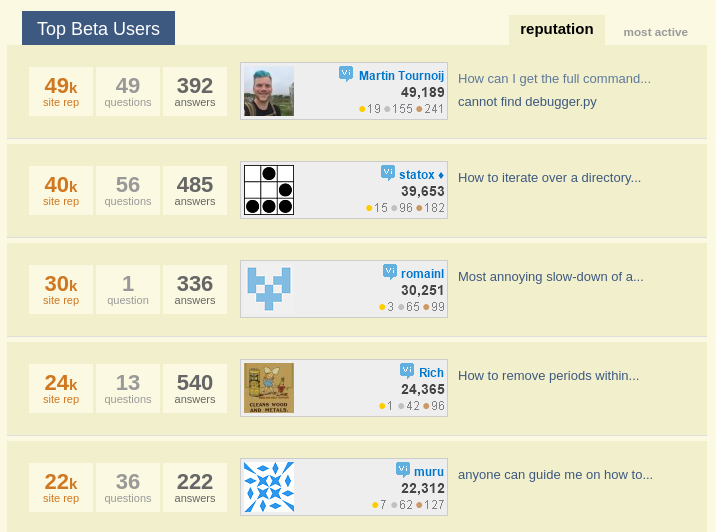

This week I sent an email to the Stack Exchange team to let them know that I was stepping down from my moderator position on [vi.se](https://vi.meta.stackexchange.com/q/1542/1841) and asking them to remove my diamond.

In 2015 I was in my last year of school and I was maintaining a small CRM project with 7 other students. One of them introduced me to Vim during this project and that was the beginning of my love story with this text editor which is still my daily driver today.

One day this friend of mine, Nobe4, created [his account](https://vi.stackexchange.com/users/1821/nobe4?tab=profile) and told me about it. The next day I was creating mine and I have to admit that, for me, it started a "who would get the most reputation points" competition against this fellow whom I consider as a very strong technical person. It turned out that after a year or two Nobe4 stopped participating on the website but for me it was too late: I was hooked and I was already enjoying helping other people more than getting imaginary points from the internet.

I have been a member of this community since April 2015 and I've been appointed as a moderator in December 2017. Over these past 6 years I have learned a lot about Vim and I think that I had the opportunity to share some pieces of interesting knowledges. As I am stepping down I thought it would be interesting to have a look at how the site grew up and what I have done to contribute in my own way to this growth.

### Some numbers about the site

[vim.stackexchange.com](https://vim.stackexchange.com) (or vi.se, for the connoiseurs) is a relatively small website from the well known [stack exchange network](https://stackexchange.com/). It was originally proposed on [area51](https://area51.stackexchange.com/proposals/80441/vi-and-vim) in November 2014 and the public beta was launched in February 2015.

In its 6 years of existence the community has grown significantly and became one of the online reference for all things about vim, neovim and their sister editors.

Here is are a few general numbers that I pulled from [data.se](https://data.stackexchange.com) to illustrate this growth:

<table>
    <thead>
        <tr>
            <th></th>
            <th>April 2015</th>
            <th>February 2021</th>
        </tr>
    </thead>
    <tbody>
        <tr>
            <td>Number of users</td>
            <td>1773</td>
            <td>29745</td>
        </tr>
        <tr>
            <td>Number of posts</td>
            <td>
                <table>
                    <thead>
                        <tr>
                            <th>Type of post</th>
                            <th>Count</th>
                        </tr>
                    <thead>
                    <tbody>
                        <tr>
                            <td>Question</td>
                            <td>643</td>
                        <tr>
                        <tr>
                            <td>Answer</td>
                            <td>1146</td>
                        <tr>
                        <tr>
                            <td>Tag wiki</td>
                            <td>81</td>
                        <tr>
                    </tbody>
                </table>
            </td>
            <td>
                <table>
                    <thead>
                        <tr>
                            <th>Type of post</th>
                            <th>Count</th>
                        </tr>
                    <thead>
                    <tbody>
                        <tr>
                            <td>Question</td>
                            <td>10405</td>
                        <tr>
                        <tr>
                            <td>Answer</td>
                            <td>13747</td>
                        <tr>
                        <tr>
                            <td>Tag wiki</td>
                            <td>229</td>
                        <tr>
                    </tbody>
                </table>
            </td>
        <tr>
    </tbody>
</table>

In the moderator dashboard (_which displays a big shiny warning "analytics data is intended for moderators only; please don't share the specifics of this data in public"_) we (the mods) can see the average number of posts by months has been pretty steady since the creation of the site, excepted for the Spring of 2020 which saw a significant spike which I don't really have an explanation for other than people got bored because of the various lock downs and started using Vim).

The number of page views however has been steadily increasing. For a reason I don't know the stats of page views starts in February 2018 with about 180.000 pages viewed each month and have been linearly growing ever since to reach about 260.000 monthly page views.

As we can see the community has grown quite a lot, today it drives about 7000 visitors each day for an average of 6.3 questions a day. Here are more numbers from the area51 website:

As we can see the stats are flirting with the out-of-beta thresholds, even thought I don't think they will reach these thresholds any time soon. As it is the case for a lot of smaller websites dedicated to niche topics on stackexchange, vi.se might very well stay in beta all of its life. And that's great! A smaller community is friendlier and usually easier to moderate which is a nice way to generate some interesting content.

### Moderator actions

Due to the relatively small size of the site, the community is quite easy to moderate. In my 3 years of moderation duty I have encountered only one or two problematic users who required the moderation team to take an action against them.

Most of the time the moderator duty is just doing the janitor job of handling the few flags coming each day, editing or deleting a post once in a while and helping the new comers to create better posts.

Here is an insight on the number of actions I've taken during my duty. My two fellow moderators [Ben](https://vi.stackexchange.com/users/10604/d-ben-knoble) and [Fill](https://vi.stackexchange.com/users/18609/filbranden) are quickly catching up on these metrics since they have been appointed about one year ago and have been doing an amazing job during these last months when I have been less active on the site.

### A bit about my work

Now I want to write a bit about me, not that it will be useful to anyone but at least to make me feeling good about myself which is still pretty important.

Let's start with the public overview of [my profile](https://vi.stackexchange.com/users/1841/statox):

Of all of these numbers the one I'm definitely the most proud of is the **~1.2m people reached** 🎉

This metric is not exactly accurate [as explained here](https://meta.stackoverflow.com/q/290491/4194289) but knowing that roughly 1 million people have read what I wrote and hopefully got some useful information out of that fills me with pride and happiness. Being able to help other people fixing their problems, learning about a new tool and improving their daily computer life has been really rewarding for me, and despite leaving my moderator position I still intend to continue helping people on the internet.

Another metric I am really pleased about is my reputation count. I reached about 39.7k reputation points placing me in the second position in the site-wide ranking, well behind our historical moderator Martin. This ranking has been pretty stable for a year or two now and I believe this is mainly due to a few historical posts which were posted in the early days of the site and continue to gather reputation pretty regularly (as an example romainl the 3rd top user stopped participating on the site in December 2016 and it took me about 4 years after that to reach his score)

What about my actual posts?

Amongst the 60 questions and 500+ answers I wrote, some of them are more important to me than the others.Firstly, I pride myself in having two of my questions in the Top ~~10~~ 11 [most frequently visited questions](https://vi.stackexchange.com/questions?tab=Frequent):

- [How to debug a mapping](https://vi.stackexchange.com/q/7722/1841) which is a question I decided to create when I saw how common were questions about mappings misunderstandings. I also self answered this question with a completely methodology which is my highest voted answer with 117 votes and around 18k views.
- [What is the difference between the vim snippets plugins?](https://vi.stackexchange.com/q/7466/1841) which was an actual question I had when I tried different snippets plugins (which I ditched from my `.vimrc` since).

My most upvoted question is [What is the Vim8 package feature and how should I use it?](https://vi.stackexchange.com/q/9522/1841) which is another question I self answered. When Vim8 was released the new package feature which is a new way to install your plugins was not entirely trivial to understand, so once I had spent a bit of time reading the doc and testing the feature by myself I thought it would be useful for other people too. My 41k page views seems to say I was right 😎 (Yes, this is me openly bragging).

Finally my favorite answer is probably the one I wrote in [Why is using arrow keys in normal mode considered bad practice?](https://vi.stackexchange.com/a/15674/1841) because this is such a non important topic which blocks so many new Vimmers and I believe it is important to remind everyone who start using this tool that they should not blindly follow some cargo cult advises.

### :x

These past 6 years as a member of such a great community have been full of learning and were also the opportunity to discuss with some really smart and well intended Vimmers and I think that's what made me enjoy this website so much.

Also even if I step down from my moderator position I will probably continue to hang out a bit on this website because I still enjoy sharing knowledge as much as I enjoy using Vim.
